# CyberpunkVRPort — C++ Hook Architecture

> **Source:** `sources - extra/vr/repo/src/` (RED4ext plugin + DXGI proxy)
> **Release:** CyberpunkVRPort-0.0.9

## Overview

CyberpunkVRPort is a multi-layer C++ mod that adds full VR support to Cyberpunk 2077. Unlike the flight mod (which is a single RED4ext plugin), VR requires interception at **three distinct levels** of the game engine:

1. **DXGI/D3D12 Proxy Layer** — intercepts the rendering pipeline for stereo output to the VR headset
2. **OpenXR Integration** — communicates with the VR headset for pose tracking, reprojection, and presentation
3. **RED4ext Plugin** — hooks into the game's animation, camera, and weapon systems for player body tracking and aim

A **shared memory bridge** connects all three layers, allowing the DXGI layer (which receives VR poses) to communicate with the RED4ext plugin (which applies them to the game skeleton) without inter-thread locking overhead.

---

## Architecture Overview

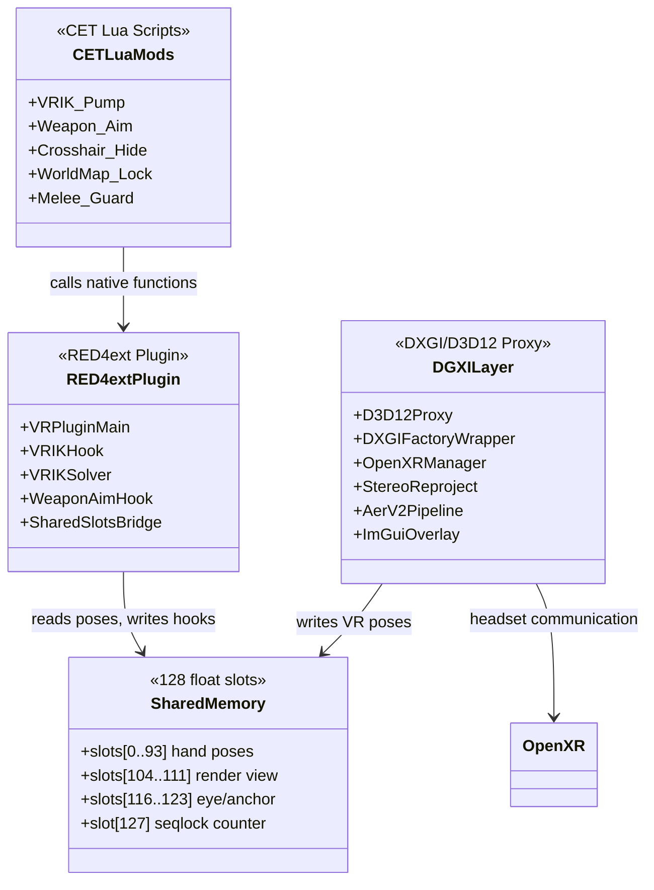

---

## Layer 1: DXGI/D3D12 Proxy

The DXGI layer is loaded as `dxgi.dll` placed next to the game executable. It proxies all DXGI/D3D12 calls, intercepting the game's rendering pipeline to produce stereo output.

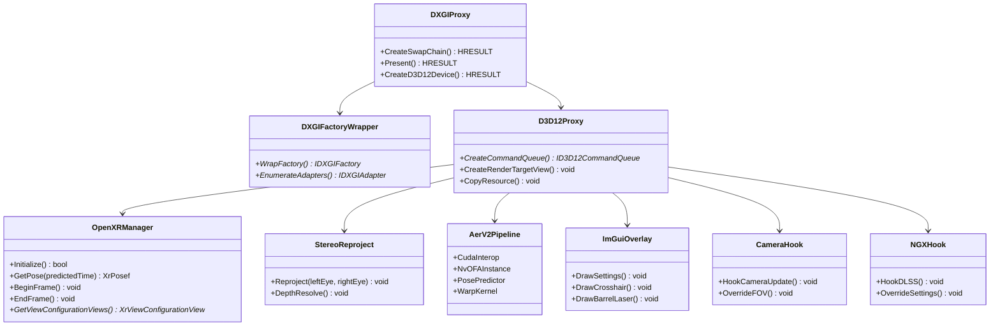

### Key DXGI Components

| Component | File | Purpose |
|-----------|------|---------|
| DXGI Factory Wrapper | `core/dxgi_factory_wrapper.cpp` | Wraps the DXGI factory to intercept swap chain creation |
| D3D12 Proxy | `core/d3d12_proxy.cpp` | Intercepts D3D12 device and command queue creation |
| OpenXR Manager | `openxr/openxr_manager.cpp` | Manages the OpenXR session lifecycle, pose tracking, and frame loop |
| Stereo Reprojection | `render/stereo_reproject.cpp` | Generates the right-eye view from the left-eye + depth buffer |
| AER v2 Pipeline | `aer_v2/aer_v2_pipeline.cpp` | Async reprojection using NVIDIA Optical Flow (CUDA interop) |
| Color Blit | `render/color_blit.cpp` | Final color copy to headset swapchain textures |
| Depth Resolve | `render/depth_resolve.cpp` | Resolves the game's depth buffer for reprojection |
| Motion Vector Warp | `render/mv_warp.cpp` | Applies motion vectors for frame interpolation |
| Optical Flow | `render/optical_flow_d3d12.cpp` | D3D12-based optical flow for motion estimation |
| Warp Pass | `render/warp_pass.cpp` | GPU warp shader for stereo reprojection |
| Sharpen Pass | `render/sharpen_pass.cpp` | Post-reprojection sharpening |
| Camera Hook | `camera/camera_hook.h` | Intercepts camera updates for VR HMD-driven camera |
| ImGui Overlay | `overlay/imgui_overlay.cpp` | In-headset settings overlay (VRIK + HUD tabs) |
| NGX Hook | `hooks/ngx_hook.cpp` | Hooks DLSS (NGX) for VR-compatible upscaling |
| AOB Scanner | `hooks/aob_scanner.h` | Pattern-based address resolution for hooks |

---

## Layer 2: RED4ext Plugin

The RED4ext plugin (`red4ext_plugin/main.cpp`) handles all game-logic hooks: player body tracking, weapon aim, camera control, and animation overrides.

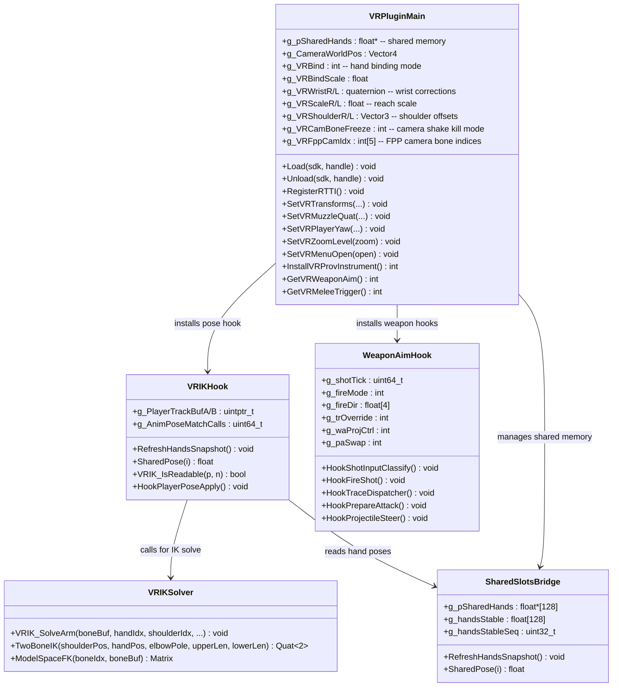

---

## VRIK: Player Body Tracking

The VR mod replaces the player's first-person body with a VR-driven IK body. The key challenge: the game's animation system evaluates poses on its own thread, while VR poses arrive on the DXGI present thread. A **seqlock shared memory protocol** bridges this gap.

### Pose Application Hook

`vrik_hook.h` installs a MinHook detour on the player's live track buffer copy function. This internal function copies the evaluated animation pose into the destination skeleton. The hook runs **after** the original, so it can overwrite bone rotations.

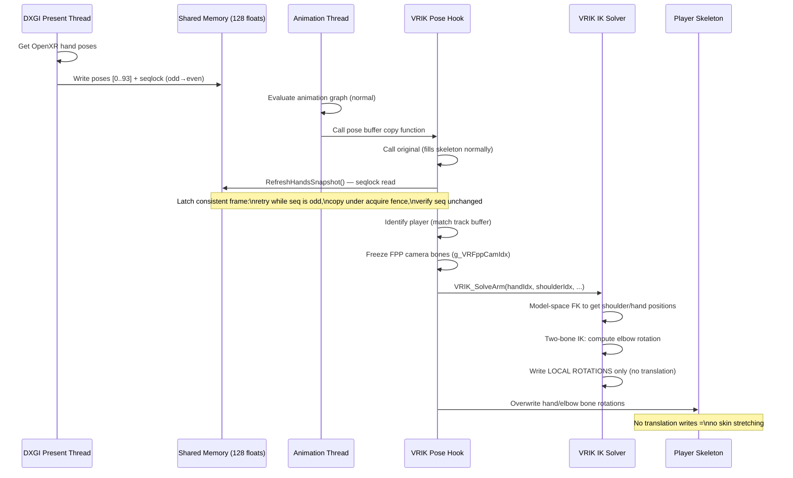

### Seqlock Protocol

The shared memory uses a **sequence lock** (seqlock) — a lock-free protocol for single-writer, multi-reader consistency:

```cpp
// Writer (DXGI present thread):
seqSlot = odd_value;           // Signal write in progress
std::atomic_thread_fence(release);
// ... write all pose slots [0..126] ...
std::atomic_thread_fence(release);
seqSlot = even_value + 1;      // Signal write complete

// Reader (VRIK hook, animation thread):
for (int tries = 0; tries < 8; ++tries) {
    uint32_t s0 = *seqSlot;    // Read sequence
    if (s0 & 1u) continue;     // Odd = write in progress, retry
    std::atomic_thread_fence(acquire);
    // Copy all 127 slots to local buffer
    std::atomic_thread_fence(acquire);
    uint32_t s1 = *seqSlot;    // Re-read sequence
    if (s0 == s1) break;       // Unchanged = consistent read
}
```

### IK Solver

`vrik_solver.h` implements a **two-bone IK** solver for arm positioning:

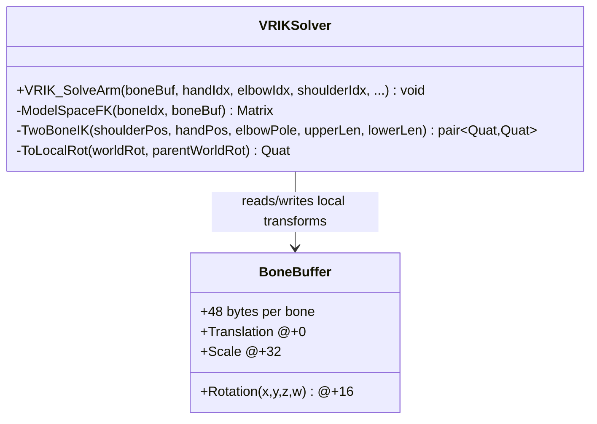

**Critical design choice:** The solver writes only **local rotations** (never translations). The game's skeleton uses parent-local transforms, so writing translation directly would cause skin stretching. The IK solver:

1. Performs model-space forward kinematics to get shoulder and hand world positions
2. Solves the two-bone IK (shoulder → elbow → hand) using the VR controller position as the target
3. Converts the resulting world rotations back to local rotations relative to each bone's parent
4. Writes only the local rotation quaternions to the bone buffer

### Calibration and Binding Parameters

The VR body requires per-user calibration. All parameters are `volatile` globals tunable via the ImGui overlay and CET native functions:

| Parameter | Default | Purpose |
|-----------|---------|---------|
| `g_VRBindScale` | 1.0 | VR units → model units scale |
| `g_VRBindOffZ` | 0.23 | Hand anchor height above head bone (calibrated) |
| `g_VRWristR_*` | euler(0,-90,0) | Right hand wrist orientation correction |
| `g_VRWristL_*` | euler(-180,-90,0) | Left hand wrist orientation correction |
| `g_VRScaleR/L` | 1.0 | Per-hand reach scale |
| `g_VRShoulderR/L` | (±0.14, -0.17, 0.05) | HMD-to-shoulder anatomical offset |
| `g_VRElbowPoleR/L` | 0.0 | Elbow bend normal nudge (degrees) |
| `g_VRElbowSwingR/L` | 1.0 | Elbow swing heuristic gain |
| `g_VRBodyUnderHMD` | 1 | Bend spine so chest sits under HMD |
| `g_VRChestDrop` | 0.40 | Eyes → chest down distance (m) |
| `g_VRHeadDrop` | 0.08 | Head bone above HMD eyes (m) |
| `g_VRSquatThreshold` | 0.20 | HMD drop to trigger body squat (m) |
| `g_VRCamSmooth` | 0.12 | Body-anchor camera low-pass lerp |

### FPP Camera Bone Freezing

The game bakes camera shake (shot recoil, melee sway, sprint settle) into specific skeleton joints (`Torso_fppCamera_*`). The VRIK hook freezes these bones every pose pass to eliminate all animation-driven camera motion — a weapon-agnostic alternative to per-weapon camera-track removal mods.

Freeze modes:

| Mode | Behavior |
|------|----------|
| 0 | Stock (no freeze) |
| 1 | Yaw-live: swing (pitch/roll) frozen, twist passes live |
| 2 | Full freeze (diagnostic — shake dead but snap/sprint doubles) |
| 3 | Swing-only freeze (default — validated in-headset) |
| 4 | Swing-only freeze on ALL five FPP camera joints (current test default) |

---

## Weapon Aim Hooks

`weapon_aim_hook.h` redirects the game's shooting pipeline so bullets fire from the VR controller's aim direction instead of the camera forward. This requires multiple interception points.

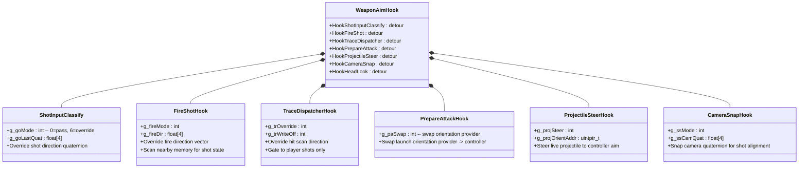

### Shooting Pipeline Interception Points

The game's shooting system involves multiple stages. The VR mod intercepts at several levels to redirect the shot direction:

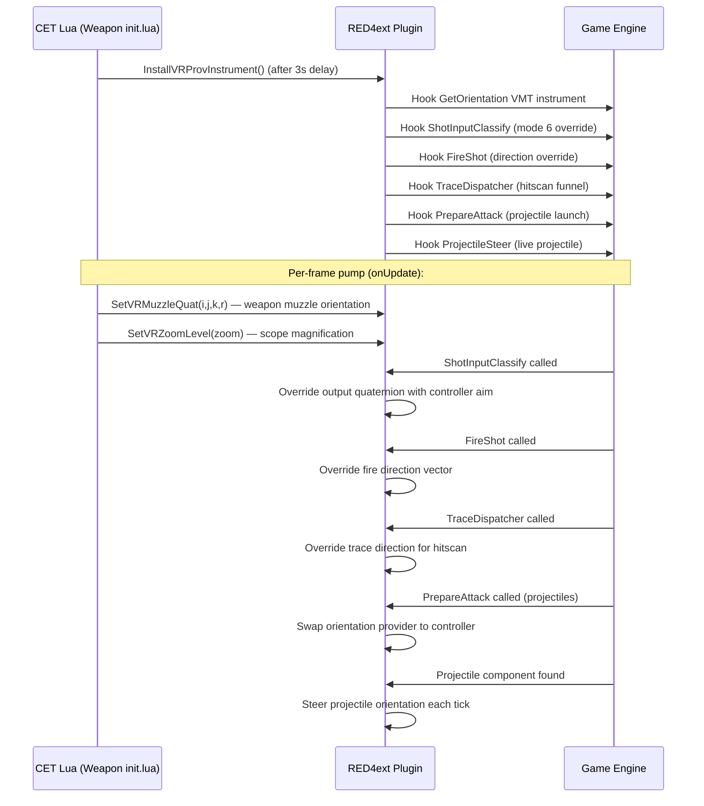

### State Diagnostics

The weapon aim hook maintains extensive diagnostic counters (all `volatile` globals):

| Counter | Purpose |
|---------|---------|
| `g_goCalls` / `g_goMutated` | ShotInputClassify total calls and mutations |
| `g_fireCalls` / `g_fireMutated` | FireShot total calls and mutations |
| `g_trShotCalls` / `g_trOvrCount` | TraceDispatcher calls and overrides |
| `g_paCalls` / `g_paSwaps` | PrepareAttack calls and provider swaps |
| `g_projSteers` | Projectile steering ticks |
| `g_waRedirects` | Total aim redirects applied |

---

## Shared Memory Slot Map

The 128-float shared memory block is the single communication channel between the DXGI layer, the RED4ext plugin, and the CET Lua scripts.

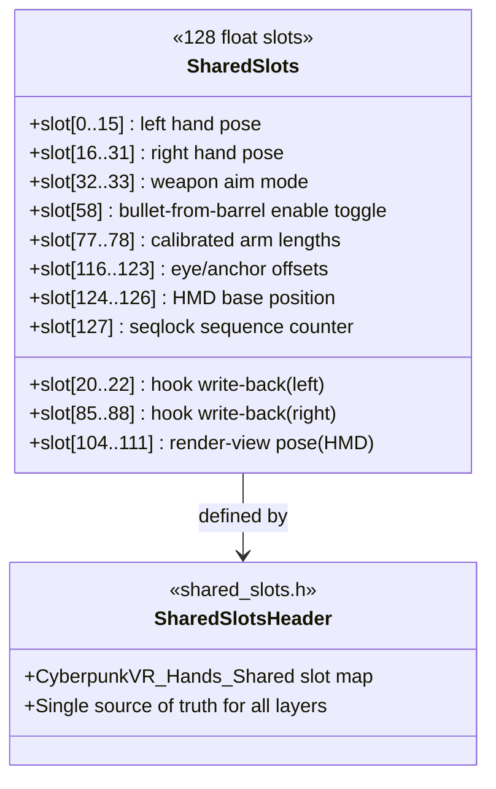

### Slot Assignments (from `shared_slots.h`)

| Slot Range | Writer | Reader | Content |
|-----------|--------|--------|---------|
| [0..93] | DXGI present thread | VRIK hook | Full hand pose data (positions, rotations, state) |
| [20..22] | VRIK hook | CET (read) | Hook write-back for left hand |
| [32..33] | CET / ImGui | Weapon aim hook | Aim mode control |
| [58] | ImGui overlay | CET Weapon script | Bullet-from-barrel toggle |
| [77..78] | Auto-calibration | VRIK solver | Calibrated arm lengths (T-pose) |
| [85..88] | VRIK hook | CET (read) | Hook write-back for right hand |
| [104..111] | DXGI present thread | VRIK hook | Render-view pose (HMD orientation + position) |
| [116..123] | DXGI present thread | VRIK hook | Eye/anchor offsets |
| [124..126] | DXGI present thread | VRIK hook | HMD base position |
| [127] | DXGI present thread | VRIK hook | Seqlock sequence counter (odd = writing, even = stable) |

---

## Layer 3: CET Lua Bridge Mods

The CET Lua mods serve as the per-frame pump and game-logic bridge. They call native functions exposed by the RED4ext plugin and handle game-state-dependent logic that's easier in Lua than C++.

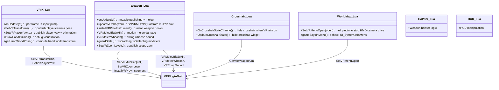

### CET Native Function Bridge

The RED4ext plugin exposes native functions that CET Lua calls. These are registered via RTTI and accessible as global functions in CET:

| CET Function | Plugin Implementation | Shared Slots Written |
|-------------|---------------------|---------------------|
| `SetVRTransforms(...)` | Writes camera position, orientation, and HMD pose to shared slots | [104..111], [124..126] |
| `SetVRPlayerYaw(yaw, camQuat, camPos, entPos, entQuat)` | Publishes player yaw and entity orientation | Player tracking slots |
| `SetVRMuzzleQuat(i,j,k,r)` | Writes weapon muzzle world orientation | Muzzle slots |
| `SetVRZoomLevel(zoom)` | Publishes live camera zoom for laser dot scaling | Zoom slot |
| `SetVRMenuOpen(open)` | Notifies plugin that a menu is open (stops HMD camera drive) | Menu slot |
| `InstallVRProvInstrument()` | Installs GetOrientation VMT instrument + weapon aim hooks | — |
| `GetVRWeaponAim()` | Reads weapon aim enable toggle from shared memory | Reads [58] |
| `GetVRMeleeTrigger()` | Reads VR controller trigger state | Trigger slot |
| `SetVRHandOffset(pitch, yaw, roll, hand)` | Updates wrist correction quaternion | Wrist slots |
| `SetVRCamBoneFreeze(mode)` | Sets FPP camera bone freeze mode | Freeze slot |
| `SetVRPairSlew(rate)` | Sets clean-pair XY slew rate | Slew slot |
| `SetVRPairLead(lead)` | Sets clean-pair prediction factor | Lead slot |

---

## VR Motion Melee System

The CET `Weapon` mod implements VR motion melee entirely through game-native systems — no custom damage code in C++:

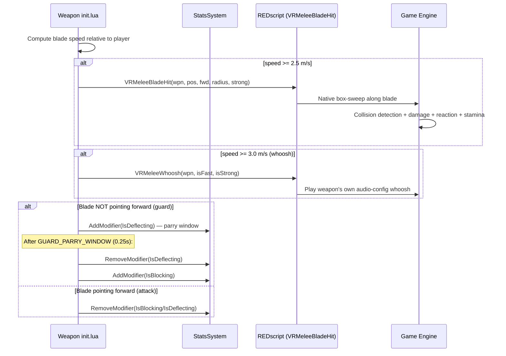

### Guard/Parry Implementation

The guard system sets game stats directly (`IsBlocking`, `IsDeflecting`) without entering the Player State Machine (PSM) `MeleeBlock` state. This avoids all the debuffs the flat game applies (AimWalk slow-walk, sprint interrupt, block animations):

- **Blade forward (thrust cone, dot ≥ 0.50)** → guard OFF (attack intent)
- **Blade in any other orientation** → guard ON (same frame)
- **Guard OFF→ON transition** → `IsDeflecting` for 0.25s (parry window), then settles to `IsBlocking`
- Stamina drains natively on blocked hits (not god mode)
- Composes freely with swings (mid-swing the blade usually leaves the thrust cone)

---

## DXGI Rendering Pipeline

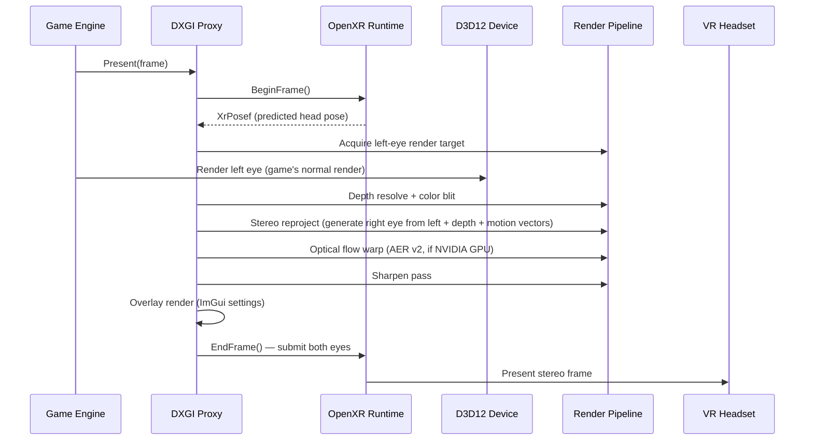

---

## Summary: Multi-Layer Architecture

| Layer | Technology | Key Responsibility |
|-------|-----------|-----------------|
| **DXGI Proxy** | D3D12 interception + OpenXR | Stereo rendering, headset pose tracking, reprojection |
| **RED4ext Plugin** | MinHook + RTTI | Player body IK, weapon aim redirect, camera control |
| **CET Lua** | CET API | Per-frame pump, game-state logic, stat modifiers, UI hiding |
| **Shared Memory** | 128-float seqlock block | Inter-layer communication (poses, settings, state) |

### What the VR Mod Achieves via C++ Hooks

| Capability | CET Lua Only | VR Mod (C++ + CET) |
|-----------|-------------|---------------------|
| **Player body tracking** | Not possible (no bone access) | Pose-apply hook + IK solver writes hand/elbow rotations |
| **Weapon aim redirect** | Not possible | Multiple detour hooks on shooting pipeline |
| **Camera control** | Limited (camera API) | Bone freeze + camera hook + OpenXR-driven HMD camera |
| **Stereo rendering** | Not possible | DXGI/D3D12 proxy + OpenXR + reprojection pipeline |
| **Motion melee** | Partial (game stats) | CET detects swing speed, REDscript does native damage |
| **Guard/parry** | Partial (PSM states) | CET sets stats directly, bypasses PSM debuffs |
| **Crosshair hiding** | Possible (widget API) | CET observes crosshair controller, reads shared memory toggle |
| **World map** | Possible (observe) | CET notifies plugin to stop HMD camera drive in menus |

### Key Files Reference

| File | Purpose |
|------|---------|
| `red4ext_plugin/main.cpp` | Plugin entry, RTTI registration, native function exposure, shared memory setup |
| `red4ext_plugin/vrik/vrik_hook.h` | Pose-apply MinHook detour, seqlock reader, FPP camera bone freeze |
| `red4ext_plugin/vrik/vrik_solver.h` | Two-bone IK solver (model-space FK + local rotation write) |
| `red4ext_plugin/weapon/weapon_aim_hook.h` | Weapon aim redirect hooks (shot, trace, projectile, PrepareAttack) |
| `common/shared_slots.h` | Shared memory slot assignments (single source of truth) |
| `dxgi/core/d3d12_proxy.cpp` | D3D12 device/command queue interception |
| `dxgi/core/dxgi_factory_wrapper.cpp` | DXGI factory wrapping for swap chain interception |
| `dxgi/openxr/openxr_manager.cpp` | OpenXR session lifecycle and pose tracking |
| `dxgi/openxr/openxr_frameloop.cpp` | OpenXR frame loop (BeginFrame/EndFrame) |
| `dxgi/openxr/openxr_present.cpp` | Stereo frame submission to headset |
| `dxgi/render/stereo_reproject.cpp` | Right-eye generation from left + depth |
| `dxgi/aer_v2/aer_v2_pipeline.cpp` | Async reprojection (NVIDIA Optical Flow + CUDA) |
| `dxgi/camera/camera_hook.h` | Camera update interception for HMD-driven camera |
| `dxgi/overlay/imgui_overlay.cpp` | In-headset settings overlay |
| `dxgi/hooks/ngx_hook.cpp` | DLSS/NGX integration for VR-compatible upscaling |
