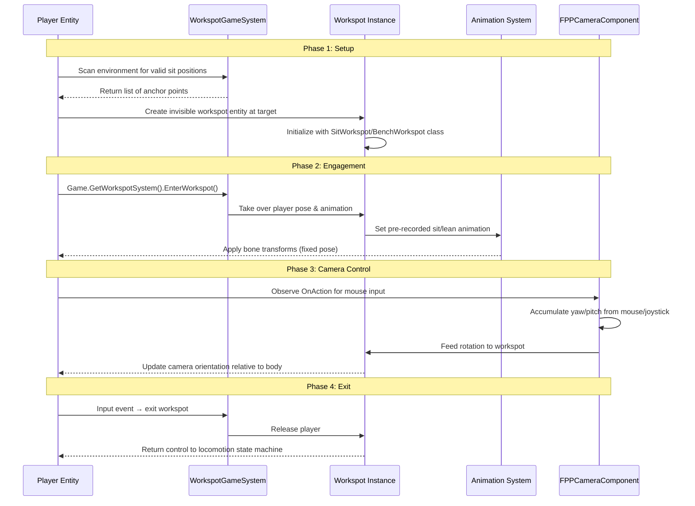
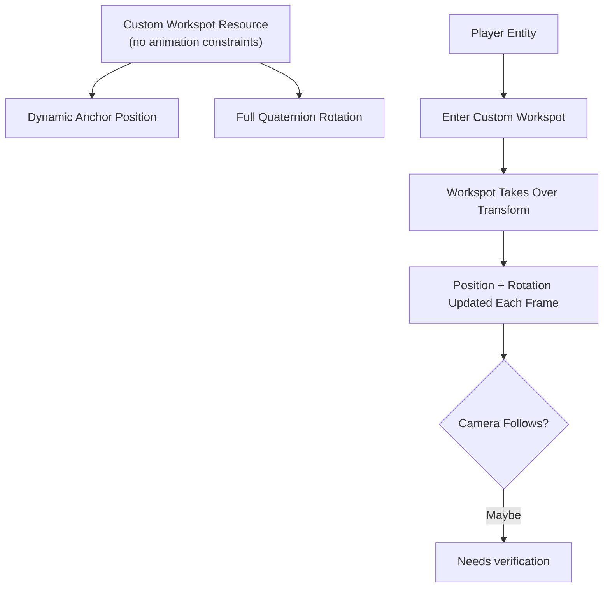
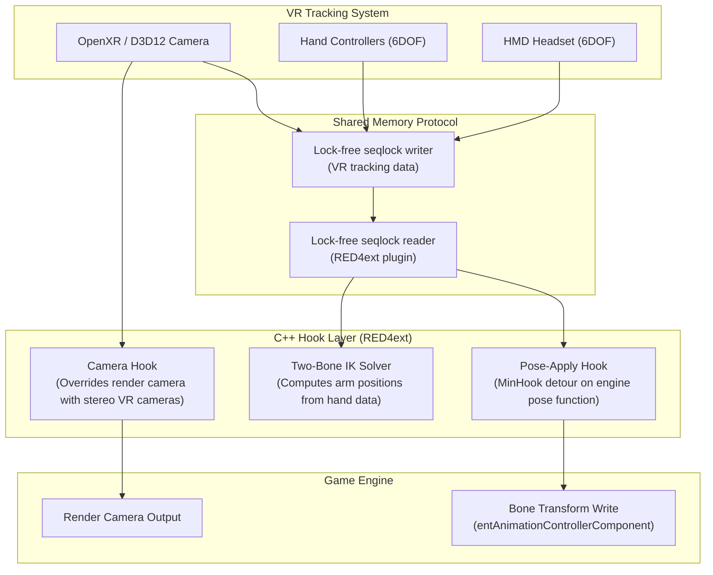
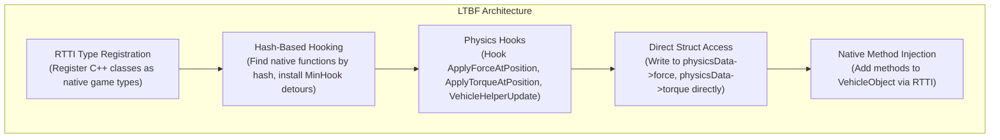
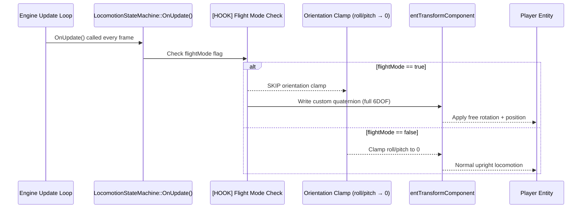
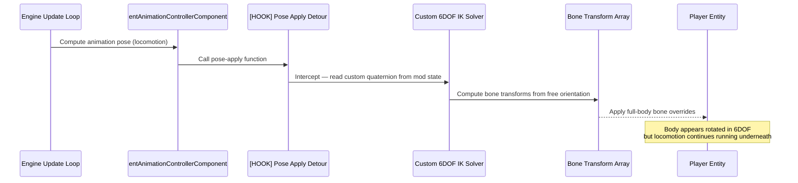
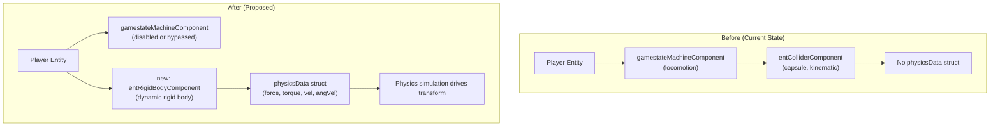
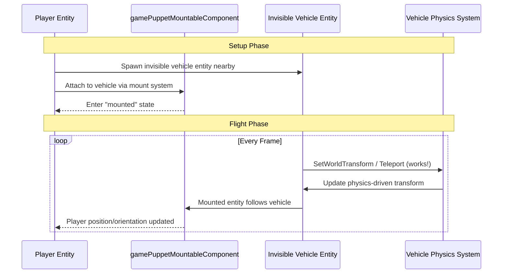
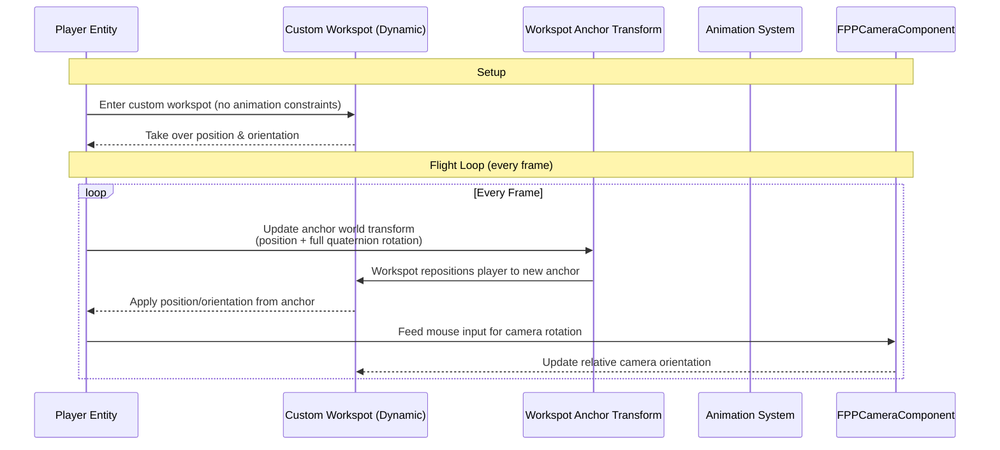

# Free Player Manipulation — C++ Hook Analysis

> **Question**: What would it take to make the player freely controllable like a vehicle is?
>
> This document covers workspot limitations, the Unity player-controller vs rigidbody analogy, and proposed C++ hook approaches for 6DOF free-flight in Cyberpunk 2077 via RED4ext.

---

## Table of Contents

1. [Overview](#1-overview)
2. [CET Testing Summary](#2-cet-testing-summary)
3. [Root Cause Analysis](#3-root-cause-analysis)
4. [Unity Analogy: PlayerController vs Rigidbody](#4-unity-analogy-playercontroller-vs-rigidbody)
5. [Workspot System Analysis](#5-workspot-system-analysis)
6. [VR Mod Approach (Cyberpunk VR Port)](#6-vr-mod-approach-cyberpunk-vr-port)
7. [LTBF Pattern — Vehicle Flight Reference](#7-ltbf-pattern--vehicle-flight-reference)
8. [Proposed Approaches A–E](#8-proposed-approaches-a-e)
9. [Comparison Matrix](#9-comparison-matrix)
10. [Camera Considerations](#10-camera-considerations)
11. [Recommended Path Forward](#11-recommended-path-forward)
12. [What C++ Hooks Would Be Needed](#12-what-c-hooks-would-be-needed)

---

## 1. Overview

The goal is **free player manipulation**: enabling the player character to rotate freely in all three axes (roll, pitch, yaw) and move through 6 degrees of freedom, analogous to how vehicles can be teleported or driven via their physics data.

This has been exhaustively tested at the CET (Cyber Engine Tweaks / Lua) layer. The conclusion is that **no CET method achieves full 3-axis rotation** because the player's locomotion state machine enforces orientation constraints every frame, overriding any transform modifications.

The solution requires moving to a C++ level via RED4ext — hooking into the engine systems that enforce the constraint and replacing it with free-form control.

---

## 2. CET Testing Summary

### What Works (CET)

| Method | Roll | Pitch | Yaw | Scope |
|--------|------|-------|-----|-------|
| `TeleportationFacility:Teleport()` | ❌ | ❌ | ✅ | Body yaw + position |
| `FPPCameraComponent:SetLocalOrientation(quat)` | ✅ | ✅ | ✅ | Camera only (body stays upright) |

### What Doesn't Work (CET)

| Method | Result |
|--------|--------|
| `SetWorldTransform` on player | Complete no-op — doesn't set any axis |
| `SetWorldTransform` + `EnableTransformUpdates(false)` | Still no-op |
| Teleport with `EulerAngles` | Only yaw sticks; roll/pitch clamped to 0 |
| Teleport with `Quaternion` | No overload exists — errors |
| Ragdoll + impulses | `CanRagdoll()` = false; no ragdoll component |
| `PSImpulse` for rotation | Translational only — no angular/torque field |
| `PhysicalImpulseEvent` | Player has no physics rigid body to receive it |

**Summary**: CET can set position and yaw. Roll and pitch are always clamped to 0 by the locomotion system.

---

## 3. Root Cause Analysis

The player's locomotion state machine enforces `roll=0, pitch=0` every frame. This cannot be bypassed at the CET/Lua level because:

- **SetWorldTransform** — locomotion overwrites it immediately after
- **EnableTransformUpdates(false)** — the override is in a different system that ignores this flag
- **Teleport** — succeeds at API level, but locomotion re-applies orientation constraints afterward
- **Airborne state** — locomotion still runs while airborne; no exception path exists

### Why Vehicles Work But Players Don't

```mermaid
flowchart LR
    subgraph Player["Player Entity"]
        A1["gamestateMachineComponent\n(locomotion driver)"] --> A2["entTransformComponent\n(overwritten every frame)"]
        A3["entColliderComponent\n(capsule, kinematic)"]
    end

    subgraph Vehicle["Vehicle Entity"]
        B1["VehicleObject.physicsData\n(force, torque, vel, angVel)"] --> B2["Physics simulation\n(drives transform)"]
        B3["entColliderComponent\n(rigid body)"]
    end

    style A1 fill:#f96,
    style B1 fill:#69f,
```

| Aspect | Player (Locomotion-Driven) | Vehicle (Physics-Driven) |
|--------|---------------------------|--------------------------|
| Transform source | State machine writes every frame | Physics simulation drives it |
| Rotation control | Clamped to roll=0, pitch=0 | Full 3-axis via torque/forces |
| External transform API | Overridden (no-op) | Accepted by physics system |
| Physics body | None (kinematic capsule) | Yes (rigid body) |

---

## 4. Unity Analogy: PlayerController vs Rigidbody

REDengine's architecture maps closely to Unity's two control schemes:

```mermaid
classDiagram
    class PlayerEntity {
        +gamestateMachineComponent
        +entColliderComponent
        +moveComponent
        +entTransformComponent
    }

    class VehicleEntity {
        +VehicleObject
        +physicsData struct
        +entColliderComponent
        +entTransformComponent
    }

    class GameStateStateMachine {
        +OnUpdate()
        +processInput()
        +clampOrientation()
        +writeTransform()
    }

    class PhysicsSystem {
        +ApplyForce()
        +ApplyTorque()
        +simulateStep()
        +updateTransform()
    }

    PlayerEntity --> GameStateStateMachine : "driven by"
    VehicleEntity --> PhysicsSystem : "driven by"

    GameStateStateMachine ..|> "CharacterController equivalent"
    PhysicsSystem ..|> "Rigidbody equivalent"
```

### Key Mapping

| REDengine | Unity Equivalent | Behavior |
|-----------|-----------------|----------|
| `gamestateMachineComponent` | `CharacterController` / `PlayerController` | Kinematic, code-driven movement |
| `entColliderComponent` (player) | Capsule Collider (kinematic) | Collision queries only, no dynamics |
| `moveComponent` | `CharacterMotor` / custom mover | Movement execution |
| `VehicleObject.physicsData` | `Rigidbody` component | Physics simulation drives transform |
| Vehicle physics system | Unity `Physics.Simulate()` | Forces/torques → position/rotation |

**Implication**: To get vehicle-like free rotation for the player, we need to either **bypass the CharacterController (locomotion)** or **give the player a Rigidbody equivalent**.

---

## 5. Workspot System Analysis
n
### API Surface

| Class | Methods | Fields | Notes |
|-------|---------|--------|-------|
| `WorkspotGameSystem` | 32 | — | Core system — manages workspot instances, queries |
| `WorkspotResourceComponent` | 0 | 1 field | Implements `IPlacedComponent` — anchor point for workspot |
| `AIUseWorkspotCommand` | 3 fields | — | `AICommand` — tells NPC to use a workspot |
| `AIBaseUseWorkspotCommand` | 3 fields | — | Base class for AI workspot commands |
| `WorkspotMapperComponent` | 14 methods, 1 field | — | `ScriptableComponent` — maps workspot resources to placements |

### How "Sit Anywhere" Mod Uses Workspots



### Workspot Limitations for Free Manipulation

| Limitation | Impact |
|-----------|--------|
| Fixed poses (sit, lean, bench) | Not dynamic 6DOF — only preset animations |
| Anchor point is typically static | Cannot fly or move freely while in workspot |
| Body follows preset animation | Camera rotation works but body posture locked |
| Workspot resource expects animations | Dynamic transforms may not be supported |

### Could Workspots Enable Free Player Manipulation?

**Partially, with caveats.** A mobile workspot (one that moves) could take over the player's position and orientation. However:
- Workspots use pre-recorded animations, not dynamic transforms
- The anchor is typically static — a custom workspot would need dynamic position updates
- Full 3-axis rotation requires a custom workspot resource with no animation constraints
- **This is an untested approach** — lower confidence than C++ hooks



---

## 6. VR Mod Approach (Cyberpunk VR Port)

The CyberpunkVRPort mod does **NOT** directly control the player's rigid body either. Instead, it works **downstream** — at the animation/output level.

### Architecture



### Key Insight: Downstream Manipulation

| Aspect | What VR Mod Does | Why It's "Downstream" |
|--------|-----------------|----------------------|
| **Target** | Animation output (bone transforms) | After locomotion has already computed pose |
| **Player Locomotion** | Still runs normally | Unchanged — only visual layer overridden |
| **Manipulation Level** | Render-level bone override | Not physics/locomotion level |
| **Body Orientation** | Computed from VR tracking → applied to bones | Body appears rotated but locomotion thinks it's upright |

**Lesson**: The VR mod proves that **hooking the pose-apply function** is a viable approach. But it only handles hands/head — for full 6DOF player control, we'd need to extend this to ALL body bones and compute orientation from a custom quaternion.

---

## 7. LTBF Pattern — Vehicle Flight Reference

"Let There Be Flight" (LTBF) shows the pattern for physics-level manipulation of vehicles:



### LTBF Pattern Breakdown

| Step | Technique | Purpose |
|------|-----------|---------|
| 1. RTTI Registration | Register custom C++ classes as native game types | Make mod types accessible from Lua/scripting layer |
| 2. Hash-Based Hooking | Resolve native function hashes via RTTI scanner, install MinHook detours | Intercept engine functions without source-level access |
| 3. Physics Hooks | Detour `ApplyForceAtPosition`, `ApplyTorqueAtPosition`, `VehicleHelperUpdate` | Gain control over physics simulation |
| 4. Direct Struct Access | Read/write `physicsData->force`, `physicsData->torque`, etc. | Drive vehicle motion via force/torque fields |
| 5. Native Method Injection | Add new methods to existing classes via RTTI reflection | Expose custom flight control API to Lua |

**Key Difference from Player**: LTBF works because vehicles have a `physicsData` struct with force, torque, velocity, and angularVelocity fields. The player does **not** have one.

---

## 8. Proposed Approaches A–E

### Approach A: Locomotion Hook (Most Promising)

Hook the locomotion state machine's orientation enforcement at the C++ level.



**What to hook**: The native function in `gamestateMachineComponent` that clamps roll/pitch to 0 each frame — likely within `OnUpdate()` or a sub-function.

**Pros**:
- Directly solves the root cause (the orientation clamp)
- Enables full 6DOF rotation and translation
- Cleanest architectural approach

**Cons**:
- Need to find the exact native function hash via RTTI/RTTI scanner
- May break animations if locomotion state machine is partially bypassed
- Requires understanding of state machine update order

---

### Approach B: Animation Override (VR-Style, Full Body)

Follow the VR mod's approach but for the full body, not just hands.



**What to hook**: `entAnimationControllerComponent`'s pose-apply function — override ALL bone transforms, not just hands.

**Pros**:
- Proven approach (VR mod does this successfully for hands/head)
- Lower risk of breaking core systems (locomotion still runs normally)
- Bone-level control is granular and well-understood

**Cons**:
- Complex IK solver needed to map free quaternion → bone transforms
- Doesn't change collision geometry orientation (capsule stays upright)
- Camera-relative-to-body alignment may be incorrect
- Animation-driven systems may fight the override

---

### Approach C: Physics Body Injection

Add a physics rigid body to the player entity.



**What to do**: Create a rigid body component and attach it to the player. Disable locomotion's transform writes. Drive the rigid body with forces/torques (like LTBF for vehicles).

**Pros**:
- Clean physics simulation — natural collision response
- Full 6DOF via standard physics APIs
- Most "correct" approach from a game engine perspective

**Cons**:
- Very invasive — unprecedented in modding
- May break many systems that assume kinematic player
- Collision geometry changes (capsule → rigid body shape)
- Locomotion systems may fail without their expected state machine

---

### Approach D: Workspot Vehicle Hybrid

Use a vehicle as a "carrier" for the player.



**What to do**: Spawn an invisible vehicle entity. Mount player to it via `gamePuppetMountableComponent`. Rotate/translate the vehicle via APIs that work for vehicles (Teleport, SetWorldTransform). Player follows.

**Pros**:
- Uses existing working APIs — no new hooks needed at engine level
- Player already has mount system infrastructure for vehicles
- Lower complexity than A or C

**Cons**:
- Player is in "mounted" state — limited actions/interactions
- Camera may not follow correctly (vehicle camera vs player camera)
- Feels hacky — vehicle physics may produce jitter/unrealistic motion
- Collision geometry is vehicle-shaped, not player-shaped

---

### Approach E: Custom Workspot with Dynamic Anchor

Create a custom workspot that updates its anchor position dynamically.



**What to do**: Define a workspot resource with no animation constraints. Attach player to it. Update the workspot's world transform every frame (position + full rotation). Player follows the workspot anchor.

**Pros**:
- Workspots are designed to take over player control — this is their intended use case
- Might handle camera orientation automatically
- Lower risk than C++ hooks (uses existing engine systems)

**Cons**:
- Workspots expect animations — dynamic transforms may not be supported
- Untested approach — unknown failure modes
- May still have frame-delay or interpolation issues

---

## 9. Comparison Matrix

| Approach | Complexity | Risk | 6DOF? | Camera Follows? | Collision? |
|----------|-----------|------|-------|-----------------|-----------|
| **A: Locomotion Hook** | Medium | Medium | ✅ Full | Needs camera hook | Original capsule |
| **B: Animation Override** | High | Low | ✅ (visual only) | Needs camera hook | No (bone-level) |
| **C: Physics Body Injection** | Very High | High | ✅ Full | Needs camera hook | Yes (rigid body) |
| **D: Workspot Vehicle Hybrid** | Low | Low | ✅ Full | Vehicle camera | Vehicle collision |
| **E: Custom Workspot** | Medium | Medium | ❓ Partial | Maybe | Unknown |

---

## 10. Camera Considerations

Regardless of approach, the camera needs separate handling:

### Current State
- `FPPCameraComponent:SetLocalOrientation()` works for camera rotation at CET level
- Camera is parented to player body — if body rotates, camera parent rotates too
- This creates alignment issues in first-person view when body orientation diverges from camera direction

### Required Solutions

| Approach | Camera Strategy |
|----------|----------------|
| A (Locomotion Hook) | Lock camera to world space OR compute camera orientation from body + mouse input independently |
| B (Animation Override) | Same as A — bone override doesn't affect camera parent-child relationship |
| C (Physics Body) | Camera needs to be re-parented or use world-space offset calculation |
| D (Vehicle Hybrid) | Use vehicle's third-person camera (works well for rotation); FPP has alignment issues |
| E (Custom Workspot) | Workspot may handle camera automatically (Sit Anywhere does this) — verify |

### Vehicle Tester Observations
- **3rd person camera**: Works fine with full rotation — natural feel
- **FPP camera**: Has alignment issues when body rotates away from camera direction — needs decoupling

---

## 11. Recommended Path Forward

### Primary Recommendation: Approach A (Locomotion Hook)

**Why first?** It directly addresses the root cause — the locomotion state machine's orientation clamp. This is the most architecturally clean solution and provides full 6DOF with original collision geometry.

**Implementation sequence:**
1. Use RTTI scanner to find `gamestateMachineComponent::OnUpdate()` hash
2. Install MinHook detour on the function that clamps roll/pitch
3. Add a global "flight mode" toggle (bindable via CET hotkey)
4. When flight mode is active, skip orientation clamp and write custom quaternion
5. Test with incremental rotation ranges before full 6DOF

### Fallback: Approach D (Workspot Vehicle Hybrid)

**Why second?** It requires no engine-level hooks — only existing APIs. If Approach A proves too difficult to find the right hash/function, this approach can provide a working proof of concept using vehicle physics that we know already works.

**Implementation sequence:**
1. Spawn invisible vehicle entity via CET `World:SpawnVehicle()` or equivalent
2. Mount player to vehicle via mount system API
3. Drive vehicle with Teleport/SetWorldTransform (verified working for vehicles)
4. Iterate on camera alignment and mounted-state limitations

### Not Recommended as First Attempt:
- **Approach B**: Too complex IK requirements; visual-only 6DOF is incomplete
- **Approach C**: Unprecedented invasiveness; high risk of breaking game systems
- **Approach E**: Untested; workspots expect animations — may not support dynamic transforms

---

## 12. What C++ Hooks Would Be Needed

### Required RED4ext Capabilities

| Capability | Purpose |
|-----------|---------|
| `RED4ext` plugin framework | Base mod infrastructure (already available) |
| MinHook library | Function hooking/detour installation (standard in RED4ext) |
| RTTI scanner / reflection API | Find native function hashes for game systems |
| Native type registration | Register custom flight-state types accessible from Lua |

### Specific Functions to Hook (Approach A)

| Target System | Function to Find | Purpose |
|--------------|-----------------|---------|
| `gamestateMachineComponent` | `OnUpdate()` or orientation clamp sub-function | Intercept and skip roll/pitch clamping |
| `entTransformComponent` | Transform write setter | Write custom quaternion when flight mode active |
| (Optional) Camera system | `FPPCameraComponent::SetLocalOrientation` equivalent in C++ | Decouple camera from body rotation |

### How to Find the Hashes

1. **AdamSmasher's decompilation project** — search for `gamestateMachineComponent` methods that reference orientation, euler angles, or clamp functions
2. **RTTI scanner** — iterate through registered types, find `gamestateMachineComponent`, enumerate virtual method table for update/clamp functions
3. **Signature scanning** — match known byte patterns from decompiled pseudocode to locate function addresses at runtime
4. **Cross-reference with CET success** — the CET `TeleportationFacility:Teleport()` succeeds at setting yaw, which means it bypasses locomotion temporarily; find where locomotion re-applies orientation after teleport → that's likely the hook point

### Hook Installation Pattern (Pseudocode)

```cpp
// RED4ext v1 plugin skeleton for Approach A
// SDK: https://github.com/WopsS/RED4ext.SDK
#include <RED4ext/RED4ext.hpp>
#include <Windows.h>

// Original function pointer
typedef void (*Original_OnUpdate_t)(void*, uint64_t, float);
Original_OnUpdate_t orig_OnUpdate = nullptr;

// Global SDK + plugin state
static RED4ext::v1::PluginHandle g_Handle = nullptr;
static const RED4ext::v1::Sdk* g_Sdk = nullptr;
bool g_flightModeActive = false;

// Detour: hook the locomotion update loop
void Hooked_OnUpdate(void* self, uint64_t entity, float deltaTime)
{
    // Call original to get normal locomotion processing
    if (orig_OnUpdate)
        orig_OnUpdate(self, entity, deltaTime);

    // If flight mode is active, override orientation after locomotion ran
    if (g_flightModeActive) {
        // 1. Skip the roll/pitch clamp that locomotion applies
        // 2. Write custom quaternion to entTransformComponent
        // 3. Optionally allow position override too
        // ApplyFlightOrientation(self, entity);
    }
}

// Plugin entry points (v1 API)
RED4EXT_C_EXPORT bool RED4EXT_CALL Main(RED4ext::v1::PluginHandle aHandle,
                                        RED4ext::v1::EMainReason aReason,
                                        const RED4ext::v1::Sdk* aSdk)
{
    switch (aReason)
    {
    case RED4ext::v1::EMainReason::Load:
    {
        g_Handle = aHandle;
        g_Sdk = aSdk;

        // Find the target function address via RTTI
        // (replace with actual class/method names once identified)
        auto rtti = RED4ext::CRTTISystem::Get();
        auto cls = rtti->GetClass(RED4ext::CName("gamestateMachineComponent"));
        // auto func = cls->GetMethod(RED4ext::CName("OnUpdate"));
        // void* funcAddr = func->GetAddress();

        // Attach hook via v1 SDK hooking API
        // aSdk->hooking->Attach(aHandle, funcAddr,
        //     reinterpret_cast<void*>(&Hooked_OnUpdate),
        //     reinterpret_cast<void**>(&orig_OnUpdate));

        if (g_Sdk && g_Sdk->logger)
            g_Sdk->logger->Info(g_Handle, "[FlightMod] Loaded");
        break;
    }
    case RED4ext::v1::EMainReason::Unload:
    {
        // Detach hook if attached
        // if (g_Sdk && g_Sdk->hooking)
        //     g_Sdk->hooking->Detach(g_Handle, funcAddr);
        break;
    }
    }
    return true;
}

RED4EXT_C_EXPORT void RED4EXT_CALL Query(RED4ext::v1::PluginInfo* aInfo)
{
    aInfo->name = L"FlightMod";
    aInfo->author = L"CE2";
    aInfo->version = RED4EXT_V1_SEMVER(1, 0, 0);
    aInfo->runtime = RED4EXT_V1_RUNTIME_VERSION_LATEST;
    aInfo->sdk = RED4EXT_V1_SDK_VERSION_CURRENT;
}

RED4EXT_C_EXPORT uint32_t RED4EXT_CALL Supports()
{
    return RED4EXT_API_VERSION_1;
}
```

> **Note:** The v1 SDK provides hooking via `aSdk->hooking->Attach(handle, targetAddr, detour, &original)` — do not use raw MinHook directly. Function addresses are resolved via `RED4ext::CRTTISystem::Get()->GetClass(CName("ClassName"))->GetMethod(CName("MethodName"))`. The three exports `Main`, `Query`, and `Supports` are all required.

---

## Appendix: Related Documentation

| Document | Path |
|----------|------|
| VR Mod C++ Hooks Analysis | `docs/c++ hooks/cyberpunk vr port - c++ hooks.md` |
| LTBF C++ Hooks Analysis | `docs/c++ hooks/let there be flight - c++ hooks.md` |
| Vehicle Flight Reference | `docs/vehicle flight/let there be flight.md` |
| Rotation/Orientation Research | `docs/rotations/rotation_orientation_research_report.md` |

---

*Document generated from CET testing results, Sit Anywhere mod source analysis, Cyberpunk VR Port architecture review, and LTBF vehicle flight pattern study.*
