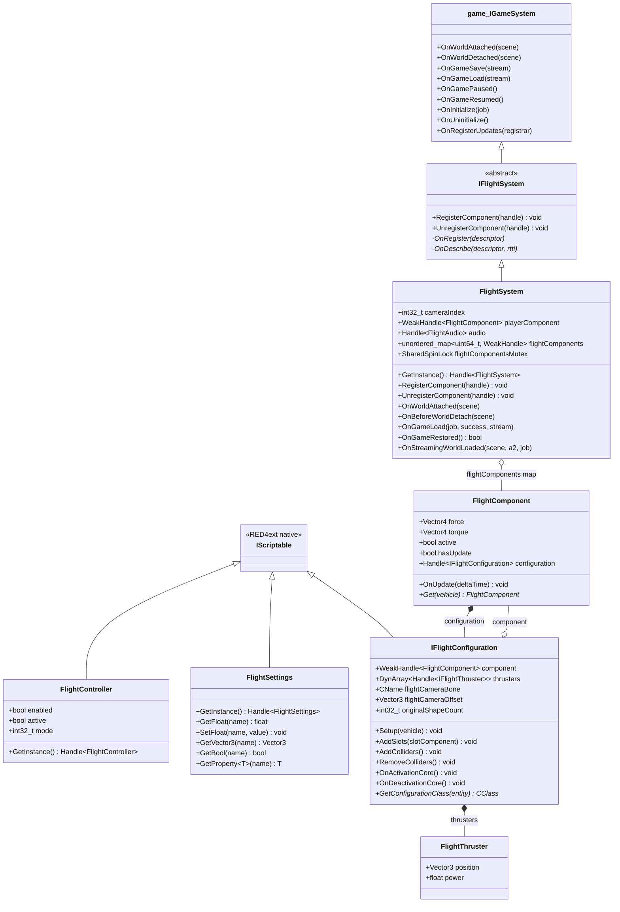
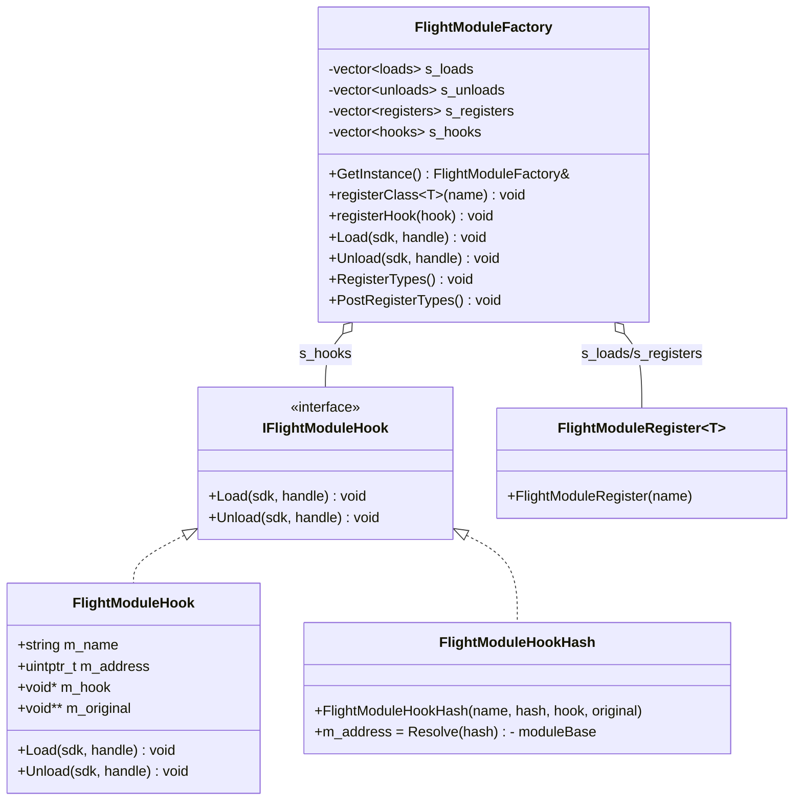
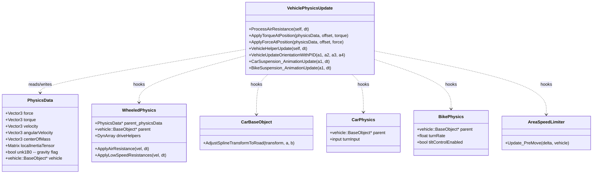
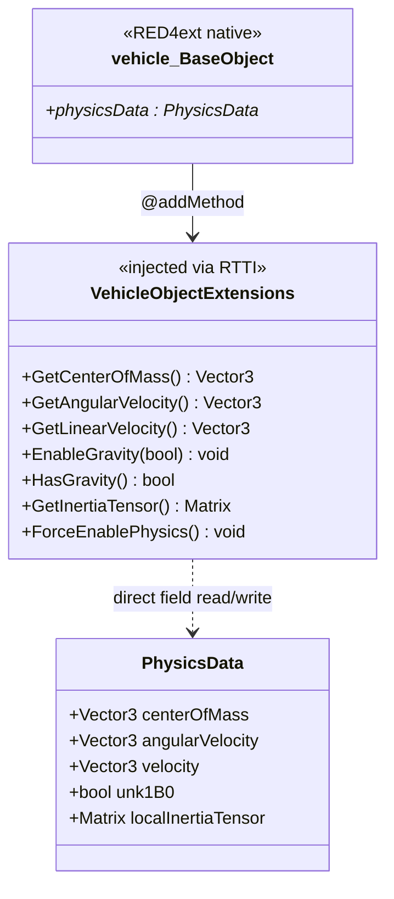
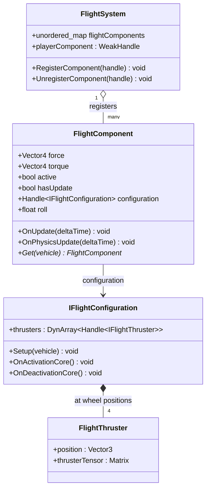
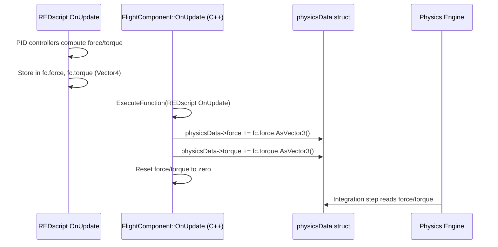
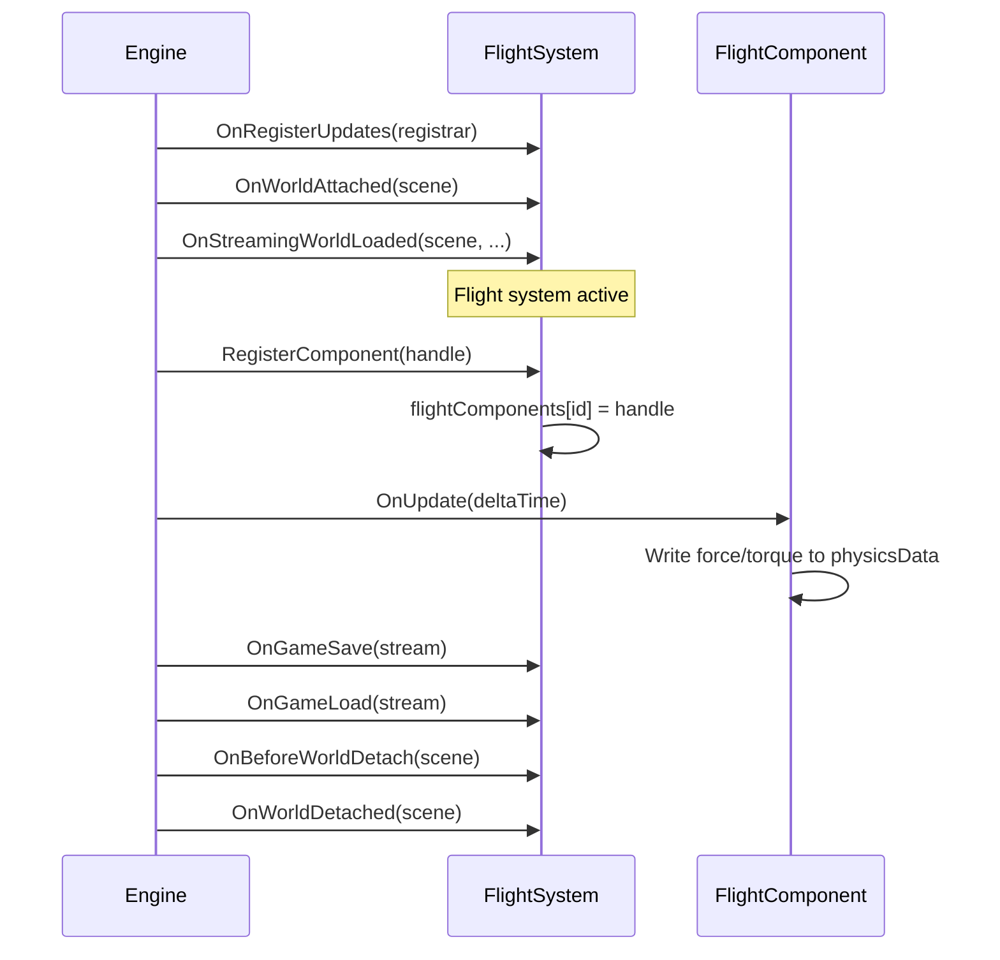
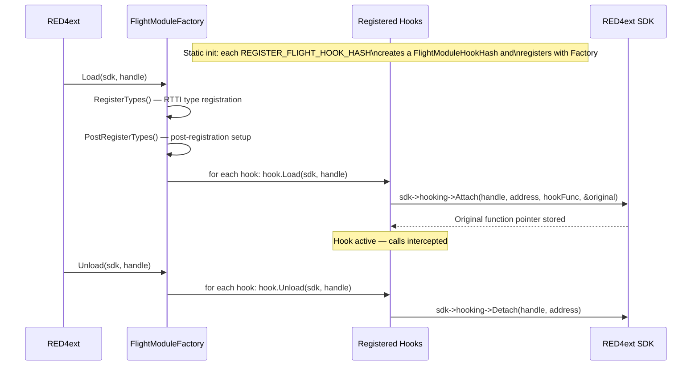

# Let There Be Flight — C++ Hook Architecture

> **Source:** `sources - extra/flying vehicles/let_there_be_flight - repo/src/red4ext/`

## Overview

Let There Be Flight (LTBF) is a **RED4ext C++ plugin** that adds 6DOF flight to Cyberpunk 2077 vehicles. Unlike CET Lua mods (which are limited to `PhysicalImpulseEvent` and event-based APIs), LTBF hooks directly into the game's native physics engine to:

- Write `force` and `torque` directly to `vehicle->physicsData` raw struct fields
- Disable gravity via direct struct field manipulation (`physicsData->unk1B0`)
- Block external collision impulses via function detour hooks
- Read exact velocity/angular velocity from native struct fields
- Register custom RTTI types as first-class game systems

---

## Architecture: RTTI Type System

LTBF uses Cyberpunk's native RTTI (Run-Time Type Information) system to register custom C++ classes as if they were native game types. This allows the plugin to create game systems, scriptable objects, and entity components that the engine treats identically to built-in ones.

### Class Hierarchy



### How RTTI Registration Works

LTBF uses a template-based RTTI system (`Engine::RTTIClass<Derived, Base>`) that hooks into RED4ext's `CRTTISystem`. Each class provides two static callbacks:

| Callback | Purpose |
|----------|---------|
| `OnRegister(Descriptor*)` | Sets class flags (abstract, native, import-only) |
| `OnDescribe(Descriptor*, CRTTISystem*)` | Registers functions, properties, and methods visible to REDscript |

**Example — `FlightController` registration:**

```cpp
RTTI_DEFINE_CLASS(FlightController, {
  RTTI_METHOD(GetInstance);
  RTTI_PROPERTY(enabled);
  RTTI_PROPERTY(active);
  RTTI_PROPERTY(mode);
});
```

This makes `FlightController.enabled`, `.active`, `.mode`, and `GetInstance()` directly accessible from REDscript — as if it were a native game class.

**Offset assertions** enforce struct layout correctness:

```cpp
RED4EXT_ASSERT_OFFSET(FlightSystem, cameraIndex, 0x48);
RED4EXT_ASSERT_OFFSET(FlightSystem, flightComponents, 0x70);
RED4EXT_ASSERT_OFFSET(FlightController, enabled, 0x40);
```

---

## Architecture: Hook System

LTBF installs **function detour hooks** on internal physics methods. When flight is active, these hooks intercept and modify the game's normal physics behavior.

### Hook Framework



### Hook Registration Macros

Two macros register hooks at compile time. The hash-based variant resolves addresses via `RED4ext::UniversalRelocBase::Resolve(hash)` — a system that maps function hashes to runtime addresses across game patches.

```cpp
// Address-based (requires a known absolute address)
REGISTER_FLIGHT_HOOK(retType, func, ...)

// Hash-based (resolves address from function hash — patch-resistant)
REGISTER_FLIGHT_HOOK_HASH(retType, hash, func, ...)
```

Each macro:
1. Declares the hook function and a `_Original` function pointer
2. Creates a `FlightModuleHookHash` instance that self-registers with `FlightModuleFactory`
3. Defines the hook function body

The `FlightModuleFactory` singleton collects all hooks at static init, then `Load()` / `Unload()` attaches/detaches them all via the RED4ext SDK hooking interface.

---

## Physics Hooks

These are the core hooks that give LTBF control over vehicle physics. Each hook checks `FlightComponent::Get(vehicle)` and checks `fc->active` — if flight is active, the hook modifies or blocks the original behavior.



### Hook Details

| Hook Function | Hash | What It Does When Flight Active |
|---------------|------|-------------------------------|
| `ApplyForceAtPosition` | 611586815 | **Returns immediately** — blocks ALL external force application (collisions, impacts). The vehicle is immune to external physical interactions. |
| `ApplyTorqueAtPosition` | 3303544265 | **Returns immediately** — blocks ALL external torque application. |
| `VehicleHelperUpdate` | 3281786499 | Saves `driveHelpers.size`, sets it to `0` during the call (disables ground driving helpers), then restores original size. |
| `VehicleUpdateOrientationWithPID` | 1414536155 | **Returns immediately** — blocks the game's road alignment PID that forces vehicles onto road splines. |
| `CarSuspension_AnimationUpdate` | 2879787320 | Reads `FlightComponent.roll` property and feeds it into `turnInput` for car animation, then calls original. |
| `BikeSuspension_AnimationUpdate` | 3191280029 | Sets `turnInput = 0`, `turnRate = 0`, `tiltControlEnabled = 0` — disables bike leaning physics. Calls original. |
| `ProcessAirResistance` | 2526549425 | Only applies air resistance when speed ≥ 100 m/s (skips below). Calls original regardless. |
| `AreaSpeedLimiter_Update` | 1836326624 | **Returns immediately** — blocks the area speed limiter (zone-based speed caps). |

### Pattern: Active Check

Every physics hook follows the same pattern:

```cpp
REGISTER_FLIGHT_HOOK_HASH(void __fastcall, HASH, HookName, Args...) {
  auto fc = FlightComponent::Get(self->parent);  // or vehicle
  if (fc && fc->active) {
    // Modify behavior or return early
    return;  // or modify args then call original
  }
  // Flight inactive — pass through to original
  HookName_Original(args...);
}
```

---

## Native Method Injection (Extensions)

LTBF injects native methods onto `vehicle::BaseObject` via RTTI expansion. These methods provide direct struct field access that CET Lua cannot achieve.



### Injected Methods and Their Implementations

| Method | Implementation | Field Accessed |
|--------|---------------|---------------|
| `GetCenterOfMass()` | `return this->physicsData->centerOfMass;` | Direct struct read |
| `GetAngularVelocity()` | `return this->physicsData->angularVelocity;` | Direct struct read |
| `EnableGravity(bool)` | `this->physicsData->unk1B0 = gravity;` | Direct struct write (reverse-engineered offset) |
| `HasGravity()` | `return this->physicsData->unk1B0;` | Direct struct read |
| `GetInertiaTensor()` | `return this->physicsData->localInertiaTensor;` | Direct struct read |
| `ForceEnablePhysics()` | Internal call to enable physics processing | Engine internal |

**Key insight:** `GetLinearVelocity()` may be a built-in vanilla method (it's used in REDscript without being in the `@addMethod` list). All others are LTBF-injected and do **not** exist in vanilla CET.

---

## FlightComponent — Per-Vehicle Flight Logic

`FlightComponent` is the central per-vehicle flight controller. Each vehicle that enters flight mode gets one.



### Force/Torque Application Flow

The critical mechanism — `FlightComponent::OnUpdate()` runs after the REDscript `OnUpdate()` (which accumulates desired force/torque from PID controllers and input), then writes directly to the physics struct:



**This is the fundamental difference from CET Lua:** `physicsData->force` is a **raw field on the physics rigid body struct**, not an event. The physics engine reads it directly during integration. There is no `PhysicalImpulseEvent`, no `QueueEvent`, no radius sphere, no collision body intersection — just a direct force accumulator.

---

## FlightSystem Lifecycle

`FlightSystem` is registered as a `game::IGameSystem` — the engine calls its lifecycle methods automatically.



### Save/Load Support

`FlightSystem` implements full save/load:
- `OnBeforeGameSave` — prepare for serialization
- `OnGameSave` — write flight state to stream
- `OnGameLoad` — restore flight state from stream
- `OnGameRestored` — post-load verification
- `IsSavingLocked` — can block saving during critical physics states

---

## Hook Installation Flow



---

## Summary: What Makes LTBF's C++ Approach Unique

| Capability | CET Lua | LTBF C++ |
|-----------|---------|----------|
| **Force application** | `PhysicalImpulseEvent` (event-based, spherical) | Direct write to `physicsData->force` / `->torque` |
| **Gravity control** | Per-frame anti-gravity delta-v compensation | `physicsData->unk1B0 = false` — disabled at struct level |
| **Velocity reading** | Position delta / deltaTime (jittery) | `physicsData->velocity` / `physicsData->angularVelocity` — exact |
| **Collision immunity** | Not possible | Hook `ApplyForceAtPosition` / `ApplyTorqueAtPosition` — return early |
| **Road alignment** | Cannot disable | Hook `AdjustSplineTransformToRoad` — return early |
| **Custom game system** | Not possible | Register as `game::IGameSystem` via RTTI |
| **Custom entity component** | Not possible | `FlightComponent` with RTTI registration |
| **Scriptable properties** | Not possible | `FlightController`, `FlightSettings` with RTTI-exposed properties |
| **Torque computation** | Avoided (center of mass impulse) | Full PID controllers with inertia tensor scaling |
| **Thruster model** | Single point | 4 thrusters at wheel positions with per-axis tensor scaling |

### Key Files Reference

| File | Purpose |
|------|---------|
| `FlightSystem.hpp` / `IFlightSystem.hpp` | Game system registration and lifecycle |
| `FlightController.hpp` | Scriptable singleton (enabled/active/mode) |
| `FlightSettings.hpp` | Scriptable settings bridge (get/set float/vector/bool) |
| `FlightConfiguration.hpp` | Per-vehicle-type flight config (thrusters, camera, colliders) |
| `Flight/Component.cpp` | Per-vehicle force/torque application to physicsData |
| `Physics/VehiclePhysicsUpdate.cpp` | All physics detour hooks |
| `Extensions/VehicleObject.cpp` | Native method injection onto VehicleObject |
| `Engine/RTTIClass.hpp` | Template base for RTTI type registration |
| `Engine/RTTIRegistrar.cpp` | RTTI registration infrastructure |
| `Utils/FlightModule.hpp` | Hook framework: macros, factory, registration |
| `EntityAddComponent.cpp` | Dynamic component attachment to entities |
