# Player Class Hierarchy — Physics Perspective

> **Scope**: Class architecture of the player entity in REDengine, viewed through the lens of physics, movement, and transform control. Includes mermaid class diagrams throughout.

---

## Table of Contents

1. [Overview](#1-overview)
2. [Entity Class Hierarchy](#2-entity-class-hierarchy)
3. [Puppet Hierarchy](#3-puppet-hierarchy)
4. [Persistent State Hierarchy](#4-persistent-state-hierarchy)
5. [Vehicle Hierarchy (Comparison)](#5-vehicle-hierarchy-comparison)
6. [Component Architecture](#6-component-architecture)
7. [Physics-Related Components Deep Dive](#7-physics-related-components-deep-dive)
8. [Player Systems](#8-player-systems)
9. [State Machine Architecture](#9-state-machine-architecture)
10. [Animation Pipeline](#10-animation-pipeline)
11. [Physics Model Comparison: Player vs Vehicle](#11-physics-model-comparison-player-vs-vehicle)
12. [Key Takeaways](#12-key-takeaways)

---

## 1. Overview

The player entity in Cyberpunk 2077 is **not a physics body**. Unlike vehicles, which are driven by a rigid body simulation with `force`, `torque`, and `angularVelocity` fields, the player is driven by a **locomotion state machine** that processes input into velocity and position while enforcing orientation constraints (`roll=0, pitch=0`) every frame.

This document maps the full class hierarchy of the player from the perspective of what controls its physical state — transform, movement, collision, animation, and camera.

### Key Distinction

| Aspect | Player | Vehicle |
|--------|--------|---------|
| Transform driver | Locomotion state machine | Physics rigid body (`physicsData`) |
| Collision | Kinematic capsule (`ColliderComponent`) | Dynamic collision shapes |
| Orientation | Clamped to upright (roll=0, pitch=0) | Free 6DOF |
| `SetWorldTransform` | No-op (overwritten by locomotion) | Works (physics accepts external transforms) |
| `Teleport` | Only yaw sticks | Full 6DOF works |
| Ragdoll | `CanRagdoll()` = false; no ragdoll component | N/A |
| Force/Torque | No `physicsData` struct; no `ApplyForce`/`ApplyImpulse` | Direct struct access via C++ hooks |

---

## 2. Entity Class Hierarchy

The player inherits through a deep chain from `IScriptable` → `Entity` → `GameObject` → `TimeDilatable` → `gamePuppetBase` → `gamePuppet` → `ScriptedPuppet` → `PlayerPuppet`.

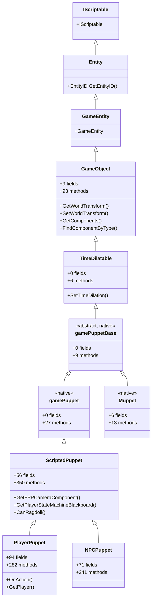

### Class Details

| Class | Fields | Methods | Flags | Role |
|-------|--------|---------|-------|------|
| `Entity` | — | — | unknown | Base entity with `EntityID` |
| `GameEntity` | — | — | unknown | Game-specific entity base |
| `GameObject` | 9 | 93 | native | World transform, component system, teleport |
| `TimeDilatable` | 0 | 6 | native | Time dilation (bullet time) support |
| `gamePuppetBase` | 0 | 9 | abstract, native | Base for all puppets — shared skeletal/collision setup |
| `gamePuppet` | 0 | 27 | native | Puppet-specific methods (mount, appearance, etc.) |
| `ScriptedPuppet` | 56 | 350 | — | Scriptable layer — AI, combat, stats, inventory, scanning, camera |
| `PlayerPuppet` | 94 | 282 | — | Player-specific: controls, vision modes, combat controller, quick slots |
| `NPCPuppet` | 71 | 241 | — | NPC-specific: AI behavior, squads, sense system |
| `Muppet` | 6 | 13 | native | Minimal puppet (cutscene/rig puppets) — sibling of `gamePuppet` |

### What's Important for Physics

- `GameObject` has `SetWorldTransform()` and `GetWorldTransform()` — but these are **overwritten** on the player by the locomotion system
- `GameObject` has `GetComponents()` and `FindComponentByType()` — how to access internal components
- `ScriptedPuppet` adds `GetFPPCameraComponent()` and `GetPlayerStateMachineBlackboard()` — camera and state machine access
- `ScriptedPuppet` adds `CanRagdoll()` — returns **false** for the player (no ragdoll system)
- `TimeDilatable` enables bullet time but doesn't affect transform control

---

## 3. Puppet Hierarchy

The puppet hierarchy is where player and NPC diverge from a shared base. Both `PlayerPuppet` and `NPCPuppet` inherit from `ScriptedPuppet`, which adds all the gameplay scripting layer on top of the native `gamePuppet` / `gamePuppetBase`.

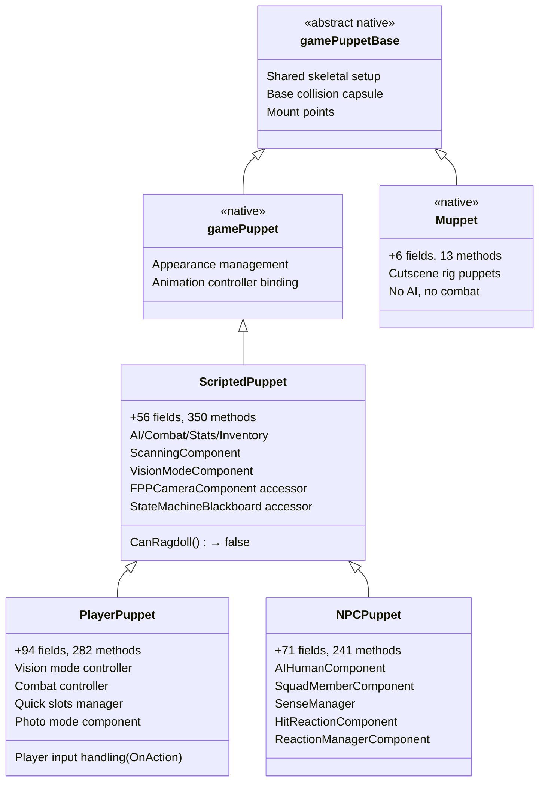

### PlayerPuppet vs NPCPuppet — Physics-Relevant Differences

| Feature | PlayerPuppet | NPCPuppet |
|---------|-------------|----------|
| Input-driven | Yes (`OnAction` observer) | No (AI-driven) |
| `gamestateMachineComponent` | Yes (player locomotion) | Yes (NPC locomotion, different states) |
| `AIHumanComponent` | Likely minimal | Full AI behavior tree (22 fields, 75 methods) |
| `HitReactionComponent` | Limited | Full (75 fields, 123 methods) |
| `ReactionManagerComponent` | Limited | Full (78 fields, 227 methods) |
| Ragdoll | `CanRagdoll()` = false | NPC ragdoll on death (usually yes) |
| Mount points | `gamePuppetMountableComponent` | Same |

> **Note**: The player **cannot ragdoll** while alive. NPCs typically can ragdoll on death. This is a critical difference — NPCs have a ragdoll/physics pathway that the player does not.

---

## 4. Persistent State Hierarchy

Each entity has a paired Persistent State (PS) class that stores save-game-relevant data.

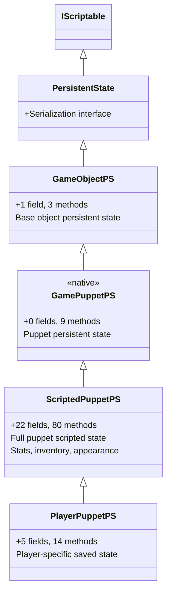

### Vehicle PS (Comparison)

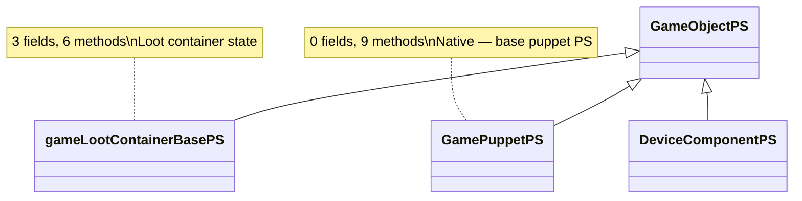

> The PS hierarchy is **not directly involved in physics** — it stores save data. But it's relevant because some physics-related flags (like ragdoll state) may be persisted here.

---

## 5. Vehicle Hierarchy (Comparison)

Vehicles follow a parallel hierarchy to puppets, but critically include a **physics rigid body** with `physicsData`.

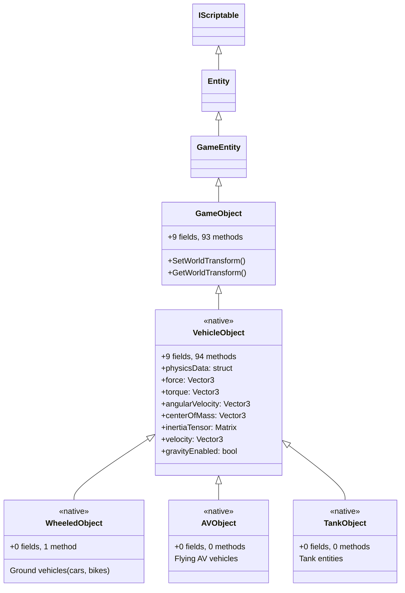

### Key Difference: `physicsData` Struct

The `physicsData` struct on `VehicleObject` is what makes vehicles physics-driven. This is the struct that **Let There Be Flight** (LTBF) hooks into directly via C++:

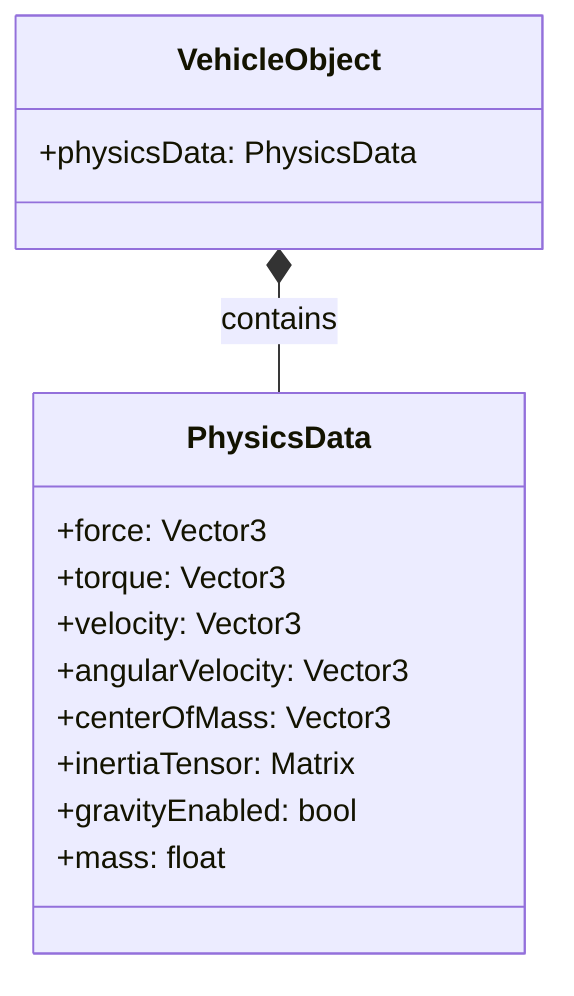

> **The player has no equivalent of `physicsData`.** This is the fundamental architectural reason why `SetWorldTransform` works on vehicles but not on the player.

---

## 6. Component Architecture

The player has **174 components** (per tester interrogation). The component hierarchy defines what systems are attached to the entity.

### Full Component Class Hierarchy

```mermaid
classDiagram
    IComponent <|-- IPlacedComponent
    IComponent <|-- GameComponent
    IComponent <|-- gamePlayerControlledComponent

    IPlacedComponent <|-- ColliderComponent
    IPlacedComponent <|-- entCameraComponent
    IPlacedComponent <|-- ISkinableComponent
    IPlacedComponent <|-- IVisualComponent
    IPlacedComponent <|-- WorkspotResourceComponent
    IPlacedComponent <|-- SimpleColliderComponent
    IPlacedComponent <|-- AreaShapeComponent
    IPlacedComponent <|-- SlotComponent
    IPlacedComponent <|-- SoundComponentBase
    IPlacedComponent <|-- BumpComponent
    IPlacedComponent <|-- ProjectileComponent
    IPlacedComponent <|-- MovingPlatform

    entCameraComponent <|-- CameraComponent
    CameraComponent <|-- FPPCameraComponent
    ISkinableComponent <|-- AnimatedComponent
    IVisualComponent <|-- MeshComponent
    IVisualComponent <|-- LightComponent
    IVisualComponent <|-- BinkComponent
    AreaShapeComponent <|-- TriggerComponent

    GameComponent <|-- AIComponent
    GameComponent <|-- ScriptableComponent
    GameComponent <|-- ScanningComponent
    GameComponent <|-- VisionModeComponent
    GameComponent <|-- Inventory
    GameComponent <|-- vehicleController
    GameComponent <|-- TargetTrackerComponent
    GameComponent <|-- SquadMemberComponent
    GameComponent <|-- MountableComponent

    AIComponent <|-- AIHumanComponent

    ScriptableComponent <|-- AIRelatedComponents
    ScriptableComponent <|-- ReactionManagerComponent
    ScriptableComponent <|-- GameplayRoleComponent
    ScriptableComponent <|-- WorkspotMapperComponent
    ScriptableComponent <|-- QuickSlotsManager
    ScriptableComponent <|-- PhotoModePlayerEntityComponent
    ScriptableComponent <|-- NPCStatesComponent

    AIRelatedComponents <|-- AIMandatoryComponents
    AIRelatedComponents <|-- AICustomComponents
    AIMandatoryComponents <|-- StatusEffectManagerComponent
    AIMandatoryComponents <|-- HitReactionComponent

    gamePlayerControlledComponent <|-- gamestateMachineComponent

    class IComponent {
        <<interface>>
        appearanceName
        appearancePath
    }
    class IPlacedComponent {
        +worldTransform
    }
    class gamestateMachineComponent {
        <<native>>
        +12 methods
        Locomotion state machine
        Enforces roll=0, pitch=0
    }
    class FPPCameraComponent {
        <<native>>
        +SetLocalOrientation(quat)
        +sensitivityMultX/Y
        +headingLocked
        +pitchMin/Max
        +yawMaxLeft/Right
    }
    class ColliderComponent {
        <<final native>>
        Collision shape (capsule)
        Kinematic - no dynamics
    }
    class AnimatedComponent {
        <<native>>
        Skinned mesh rendering
    }
```

### Components Found on PlayerPuppet (Key Subset)

| Component | Base Class | Physics Role | CET Access |
|-----------|-----------|-------------|------------|
| `gamestateMachineComponent` | `gamePlayerControlledComponent` → `IComponent` | **Locomotion driver** — processes input → velocity → position, enforces orientation | `FindComponentByType('gamestateMachineComponent')` |
| `moveComponent` | (unknown) | Movement execution — converts input to velocity vectors | Discovered via `GetComponents()` dump |
| `entColliderComponent` | `ColliderComponent` → `IPlacedComponent` | **Collision capsule** — kinematic collision queries, no dynamics | Via component dump |
| `gameHumanoidBody` | (unknown) | **Body data** — skeleton, bone references, humanoid structure | Via component dump |
| `entAnimationControllerComponent` | (unknown) | **Animation playback** — drives bone transforms from animation data | Via component dump |
| `FPPCameraComponent` | `CameraComponent` → `entCameraComponent` → `IPlacedComponent` | **First-person camera** — `SetLocalOrientation(quat)` works for full 3-axis | `GetFPPCameraComponent()` |
| `AnimatedComponent` | `ISkinableComponent` → `IPlacedComponent` | Skinned mesh rendering | Via component dump |
| `AIHumanComponent` | `AIComponent` → `GameComponent` → `IComponent` | AI behavior (minimal on player) | Via component dump |
| `WorkspotMapperComponent` | `ScriptableComponent` → `GameComponent` | Workspot resource mapping | Via component dump |
| `QuickSlotsManager` | `ScriptableComponent` → `GameComponent` | Quick slot item management | Via component dump |
| `ScanningComponent` | `GameComponent` → `IComponent` | Scanner system | Via component dump |
| `VisionModeComponent` | `GameComponent` → `IComponent` | Vision modes (Kiroshi, etc.) | Via component dump |

### Components NOT Found on Player

| Missing Component | Implication |
|-------------------|-------------|
| Ragdoll component | `CanRagdoll()` = false; no physics ragdoll pathway |
| Physics rigid body | No `physicsData` equivalent; no force/torque access |
| `ApplyImpulse`/`AddImpulse`/`ApplyForce` | Entity itself has no physics methods |
| `SetWorldPosition`/`SetWorldOrientation` | Not on entity (only on transform component, which is overwritten) |
| `GetMovementComponent`/`GetLocomotionComponent`/`GetPhysicsComponent` | Not exposed as named methods |

---

## 7. Physics-Related Components Deep Dive

### Locomotion State Machine

The `gamestateMachineComponent` is the **central physics authority** for the player. It inherits from `gamePlayerControlledComponent`, which inherits from `IComponent`.

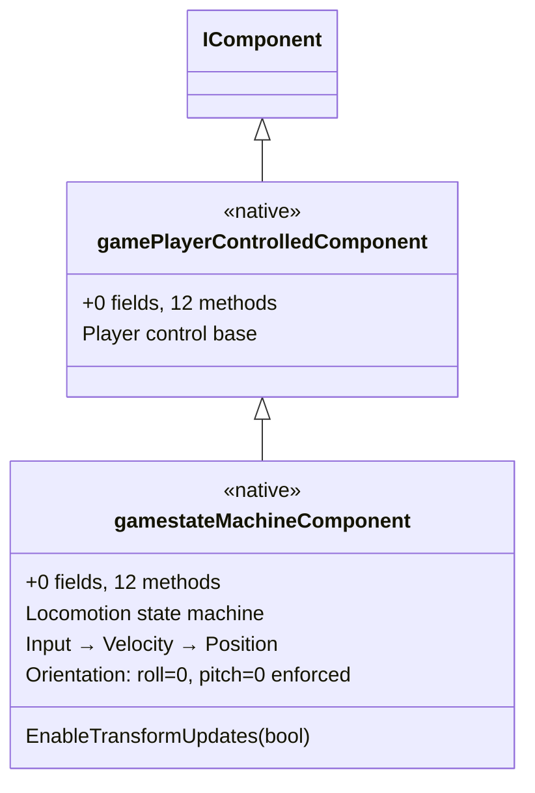

> **`EnableTransformUpdates(bool)`** was discovered via reflection (`Dump()`), but setting it to `false` does **not** stop the orientation clamping. The override happens in a different code path than transform updates.

### Camera Component

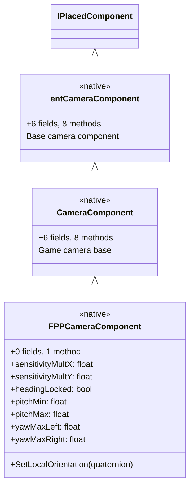

The `FPPCameraComponent` is the **only** component where full 3-axis rotation works via CET. But it only rotates the **camera**, not the body.

### Collider Component

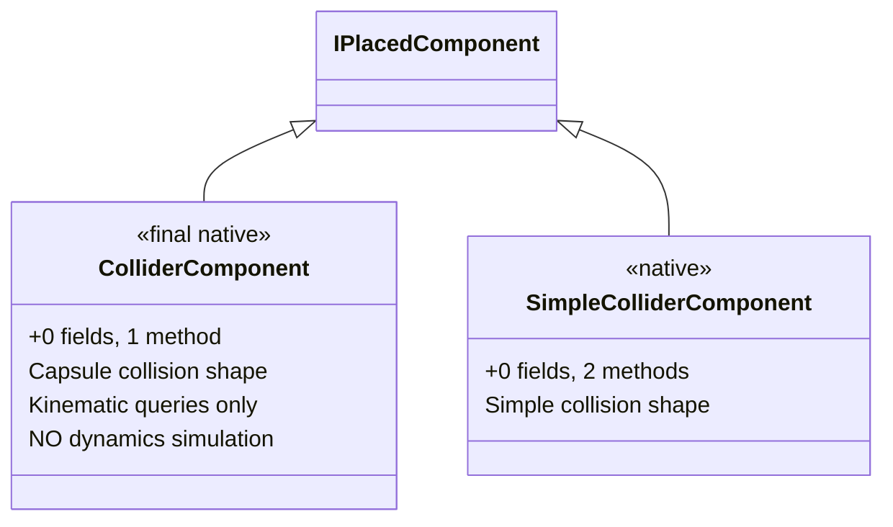

> The player's collider is **kinematic** — it detects collisions and blocks movement, but it doesn't simulate physics dynamics (no forces, no torque, no angular momentum). This is the Unity `CharacterController` equivalent.

### Mountable Component

```mermaid
classDiagram
    IComponent <|-- MountableComponent
    MountableComponent <|-- gamePuppetMountableComponent
    MountableComponent <|-- gamevehicleVehicleMountableComponent

    class MountableComponent {
        <<native>>
        Base mount interface
    }
    class gamePuppetMountableComponent {
        <<native>>
        +0 fields, 1 method
        Puppet mount points
        (player sits on vehicle)
    }
    class gamevehicleVehicleMountableComponent {
        <<native>>
        +0 fields, 4 methods
        Vehicle mount points
        (player attachment slots)
    }
```

The mountable component is how the player attaches to vehicles. When mounted, the player's transform follows the vehicle's transform — this is the only CET-accessible way to get the player to rotate in 3 axes (by rotating the vehicle they're on).

---

## 8. Player Systems

Game-wide systems that manage the player and related functionality.

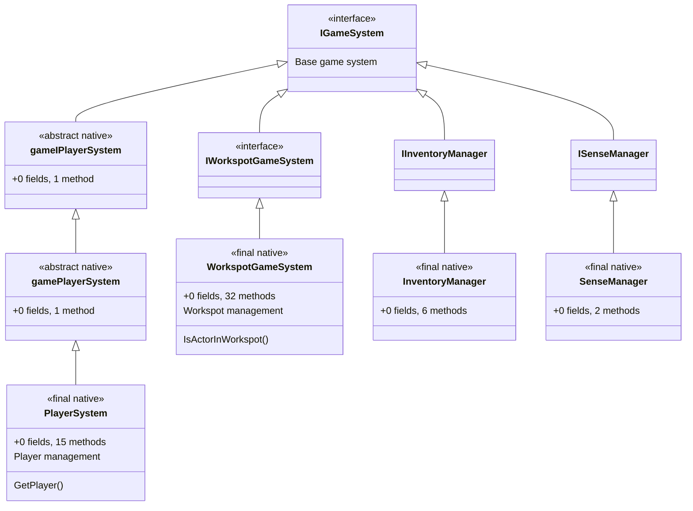

### How to Access Systems via CET

| System | CET Accessor |
|--------|-------------|
| `PlayerSystem` | `Game.GetPlayerSystem()` / `GetPlayer()` |
| `WorkspotGameSystem` | `Game.GetWorkspotSystem()` |
| `InventoryManager` | `Game.GetInventoryManager()` |
| `TeleportationFacility` | `Game.GetTeleportationFacility()` |
| `StatusEffectSystem` | `Game.GetStatusEffectSystem()` |

---

## 9. State Machine Architecture

The player's locomotion is governed by a hierarchical state machine with dozens of states and transitions. This is what enforces the orientation constraints.

### State Machine Overview

```mermaid
classDiagram
    StateFunctor <|-- DefaultTransition
    DefaultTransition <|-- LocomotionTransition
    DefaultTransition <|-- BraindanceControlsTransition
    DefaultTransition <|-- CombatGadgetTransitions
    DefaultTransition <|-- ConsumableTransitions
    DefaultTransition <|-- ComDeviceTransition

    LocomotionTransition <|-- CoverActionTransition
    LocomotionTransition <|-- AbstractLandDecisions
    LocomotionTransition <|-- FallDecisions
    LocomotionTransition <|-- JumpDecisions
    LocomotionTransition <|-- CrouchDecisions
    LocomotionTransition <|-- SprintDecisions
    LocomotionTransition <|-- ClimbDecisions
    LocomotionTransition <|-- KnockdownDecisions
    LocomotionTransition <|-- GrappleDecisions

    CoverActionTransition <|-- CoverActionEventsTransition
    CoverActionTransition <|-- InactiveCoverDecisions
    CoverActionTransition <|-- ActivateCoverDecisions

    class DefaultTransition {
        <<abstract>>
        Base state functor
        0 fields
    }
    class LocomotionTransition {
        <<abstract>>
        Locomotion base
        Movement states
        Orientation enforcement
    }
    class BraindanceControlsTransition {
        <<abstract>>
        58 methods!
        Braindance mode
    }
    class CoverActionTransition {
        <<abstract>>
        Cover system states
    }
    class CombatGadgetTransitions {
        <<abstract>>
        22 methods
        Combat gadget states
    }
``n
### Player State Machine Prereq States

The `PlayerStateMachinePrereqState` concept covers **38 types** — these are the state machine states the player can be in:

| State Category | Examples |
|---------------|----------|
| Combat | `CombatPSMPrereqState` |
| Body Carrying | `BodyCarryingPSMPrereqState` |
| Body Disposal | `BodyDisposalPSMPrereqState` |
| Aiming | `AimPSMPrereqState` |
| Device Interaction | `DeviceInteractionPSMPrereqState` |
| Workspot | `WorkspotPSMPrereqState` |
| Grapple | `GrapplePSMPrereqState` |
| Fall | `FallPSMPrereqState` |
| Jump | `JumpPSMPrereqState` |
| Crouch | `CrouchPSMPrereqState` |
| Sprint | `SprintPSMPrereqState` |
| Climb | `ClimbPSMPrereqState` |
| Knockdown | `KnockdownPSMPrereqState` |

### State Machine Blackboard

The player has a `PlayerStateMachineBlackboard` accessible via `GetPlayerStateMachineBlackboard()`. Key blackboard IDs:

| Blackboard ID | Type | Use |
|---------------|------|-----|
| `SceneTier` | Int | Scene tier (1=gameplay, 3=cutscene) — used by Sit Anywhere for HUD toggle |
| `HighLevel` | Int | High-level state (>2 = special mode) |
| `Carrying` | Bool | Carrying a body |
| `SecurityZoneData` | Variant | Current security zone |

### Low-Gravity Variants

The API reveals **low-gravity variants** of some states:
- `CrouchLowGravityDecisions` / `CrouchLowGravityEvents`
- `SprintLowGravityDecisions` / `SprintLowGravityEvents`

These suggest the engine has special handling for low-gravity locomotion — a potential hook point for free-flight mods.

---

## 10. Animation Pipeline

The animation system drives the visual representation of the player, including bone transforms.

```mermaid
flowchart TD
    A["Input (keyboard/mouse)"] --> B["gamestateMachineComponent"]
    B --> C["State Machine Decision"]
    C --> D["Locomotion State (Walk/Sprint/Fall)"]
    D --> E["moveComponent"]
    E --> F["Velocity → Position Update"]
    D --> G["Animation Request"]
    G --> H["entAnimationControllerComponent"]
    H --> I["AnimFeature_Movement"]
    I --> J["Animation Tree Evaluation"]
    J --> K["Bone Transform Output"]
    K --> L["AnimatedComponent (skinned mesh)"]
    L --> M["Visual Render"]
    F --> N["Transform Component Update"]
    N --> O["Orientation: roll=0, pitch=0 enforced"]
    B --> O
```

### Animation Features

| AnimFeature | Purpose |
|-------------|---------|
| `AnimFeature_Movement` | Base movement animation data (native, 3 methods) |
| `AnimFeature_PlayerMovement` | Player-specific movement (native, 3 methods) |
| `AnimFeature_BasicAim` | Aim animation data (native, 3 methods) |
| `AnimFeature_AimPlayer` | Player-specific aim (native, 3 methods) |
| `AnimFeature_VehicleState` | Vehicle state for vehicle-mounted animations |

### Transform Animation Events

| Event | Purpose |
|-------|---------|
| `gameTransformAnimationPlayEvent` | Play a transform animation |
| `gameTransformAnimationResetEvent` | Reset transform animation |

> The VR mod (CyberpunkVRPort) hooks at the **Bone Transform Output** stage — intercepting the pose-apply function to override hand/head bone transforms with VR tracking data. This is a **render-level** override, not a physics-level one.

---

## 11. Physics Model Comparison: Player vs Vehicle

### Player Physics Model (Locomotion-Driven)

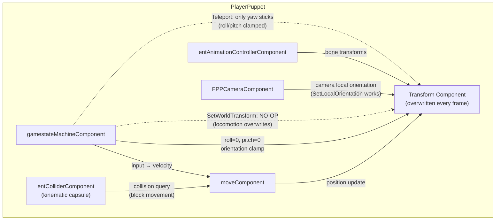

### Vehicle Physics Model (Physics-Driven)

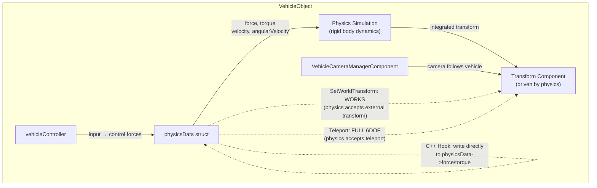

### Side-by-Side Comparison

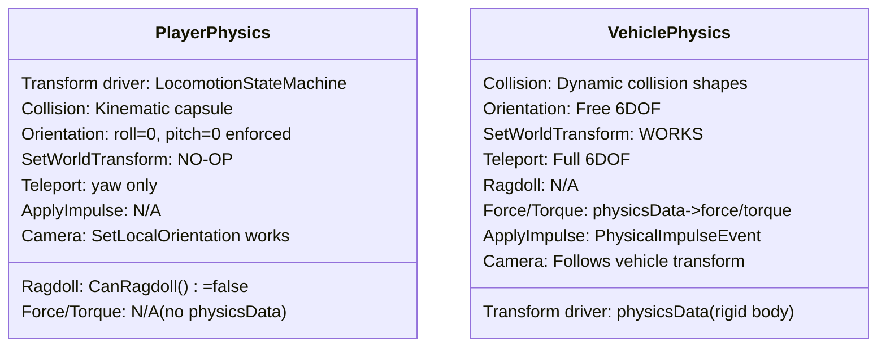

---

## 12. Key Takeaways

### What Controls the Player's Physical State

| System | Role | CET Access | C++ Hook Needed? |
|--------|------|------------|-------------------|
| `gamestateMachineComponent` | Locomotion, orientation enforcement | `FindComponentByType` (12 methods) | **Yes** — to bypass roll/pitch clamp |
| `moveComponent` | Input → velocity → position | Component dump only | Possibly — to override velocity |
| `entColliderComponent` | Kinematic collision | Component dump only | Maybe — to change collision shape |
| `entAnimationControllerComponent` | Bone transform driving | Component dump only | **Yes** — VR mod proves this is hookable |
| `FPPCameraComponent` | Camera orientation | `GetFPPCameraComponent()` (full access) | Maybe — to sync camera with body |
| `Transform Component` | World position/orientation | `SetWorldTransform` (no-op) | **Yes** — to write directly, bypassing locomotion |

### What CET Can Do vs What Needs C++

| Capability | CET (Lua) | C++ (RED4ext) |
|------------|-----------|---------------|
| Set player position | ✅ Teleport (position) | ✅ Direct struct write |
| Set player yaw | ✅ Teleport (yaw) | ✅ Direct struct write |
| Set player roll/pitch | ❌ Clamped to 0 | ✅ Hook locomotion, write transform |
| Set camera 3-axis rotation | ✅ `SetLocalOrientation(quat)` | ✅ Same or hook camera update |
| Apply force to player | ❌ No physics API | ✅ Inject physics data or hook |
| Apply torque to player | ❌ No physics API | ✅ Inject physics data or hook |
| Override bone transforms | ❌ Not exposed | ✅ Hook pose-apply (VR mod does this) |
| Disable locomotion clamp | ❌ `EnableTransformUpdates(false)` doesn't work | ✅ Hook the clamp function |
| Ragdoll the player | ❌ `CanRagdoll()` = false | ❓ Unknown — may need component injection |

### The Three Hookable Layers

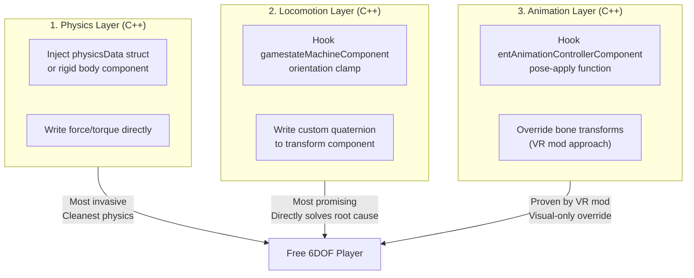

> **The locomotion layer (Approach 2) is the most promising** — it directly addresses the root cause (orientation clamping) and allows the existing transform system to carry the new orientation. See the companion doc `free player manipulation - analysis.md` for detailed approach analysis.
