# Device Hack Class Hierarchy — Device Hack Perspective

> **Scope**: Class architecture of all entities and objects involved in device hacking in REDengine, viewed through the lens of quickhack execution, device actions, and the effect pipeline. Includes mermaid class diagrams and pipeline flow diagrams throughout.

---

## Table of Contents

1. [Overview](#1-overview)
2. [Player & Cyberware Hierarchy](#2-player--cyberware-hierarchy)
3. [Device Entity Hierarchy](#3-device-entity-hierarchy)
4. [Device Component & Controller Hierarchy](#4-device-component--controller-hierarchy)
5. [Device Persistent State (PS) Hierarchy](#5-device-persistent-state-ps-hierarchy)
6. [Action Class Hierarchy](#6-action-class-hierarchy)
7. [Device Operations Hierarchy](#7-device-operations-hierarchy)
8. [Effect Executor Hierarchy](#8-effect-executor-hierarchy)
9. [The Effect/Action Pipeline](#9-the-effectaction-pipeline)
10. [Game Systems Involved in Hacking](#10-game-systems-involved-in-hacking)
11. [Key Takeaways](#11-key-takeaways)

---

## 1. Overview

Device hacking in Cyberpunk 2077 is **not a single function call** — it is a multi-layered pipeline spanning the player entity, equipment/cyberware system, device entities, their persistent state (PS), action objects, device operations, and effect executors. This document maps the full class hierarchy of every object involved, from the player who initiates the hack to the effect executor that produces the visible result.

### Key Distinction

| Aspect | Player-Initiated Hack | Programmatic (CET) Hack | Companion Orb Hack (Goal) |
|--------|----------------------|------------------------|---------------------------|
| Initiator | `PlayerPuppet` | CET Lua script | Shell entity (proposed) |
| Cyberware required | Yes (cyberdeck in `SystemReplacementCW`) | No (bypassed) | Must be emulated |
| RAM cost | Yes (`Memory` stat pool) | Bypassed via `SetCanSkipPayCost` | Own resource pool |
| Scan mode | Required (normal flow) | Bypassed | Not applicable |
| Action instantiation | Native pipeline (`SetUp()`) | Read-only descriptors from `GetQuickHackActions` | Needs full instantiation |
| Device response | Full pipeline context | Silently rejected | Must provide full context |

### Why This Matters

The testing documented in `testers/quickhack/device hack summary.md` conclusively shows that:

- **Action discovery works** — `ps:GetQuickHackActions(context)` and `ps:GetQuestActions(context)` return action objects
- **Action execution fails** — `StartAction`, `IsPossible`, `ResolveAction` all throw "error in error handling" because the action objects lack internal state (`SetUp()` was never called)
- **`ProcessRPGAction` silently succeeds** — the RPG cost pipeline runs but the device's internal logic short-circuits because the full pipeline context is missing
- **QuestForce partially bypasses** — `QuestForceDetonate` works on ExplosiveDevice because it uses a different code path that doesn't require the full quickhack pipeline

Understanding the class hierarchy is essential to identifying **what objects must exist** for the device's internal state machine to accept and process an action.

---

## 2. Player & Cyberware Hierarchy

The player entity carries the cyberware, equipment, and stat pools that the normal hacking pipeline checks. Every prerequisite validation traces back to objects on the `PlayerPuppet`.

### Player Entity Hierarchy

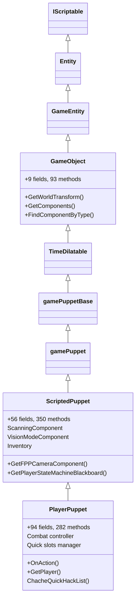

### Player PS Hierarchy

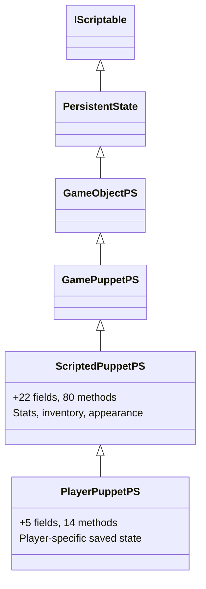

### Equipment & Cyberware System

The player's cyberdeck is managed by the `EquipmentSystem`, not by a class directly on the player. The cyberdeck is an **item** equipped in the `SystemReplacementCW` equipment area.

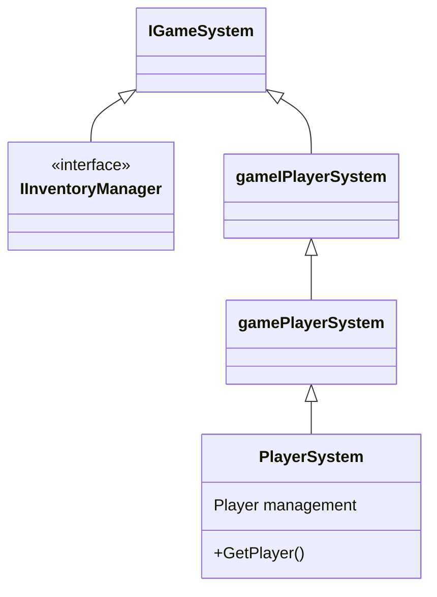

```mermaid
classDiagram
    EquipmentSystem --> EquipmentSystemData
    EquipmentSystemData --> "FindItemInEquipAreaByTag(Cyberdeck, SystemReplacementCW)"

    class EquipmentSystem {
        +GetData(owner: GameObject)
        +IsCyberdeckEquipped(owner)
    }
    class EquipmentSystemData {
        +FindItemInEquipAreaByTag(tag, area)
    }
```

### Quickhack Program Loading Pipeline

The player's available quickhacks are built from the equipped cyberdeck item's TweakDB record:

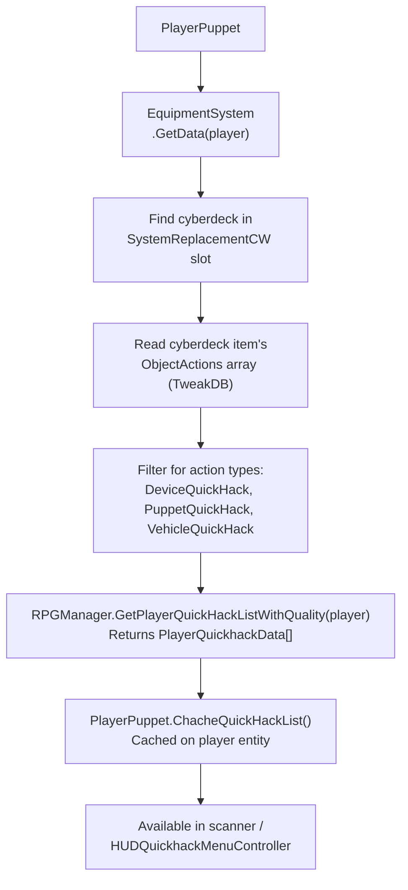

### Key Validation Points on the Player

| Validation | Where Checked | What Object Is Involved |
|---|---|---|
| Cyberdeck equipped | `EquipmentSystem:IsCyberdeckEquipped(owner)` | `EquipmentSystem` -> `EquipmentSystemData` |
| Quickhack programs installed | `RPGManager.GetPlayerQuickHackListWithQuality(player)` | Cyberdeck item record -> `ObjectActions` array |
| RAM available | `PayCost()` -> Memory stat pool | `StatPoolsSystem` -> Memory pool on player |
| Scan mode active | `HUDQuickhackMenuController` | `ScanningComponent` on `ScriptedPuppet` |
| Player alive/active | `ScriptedPuppet.IsActive()` | `PlayerPuppet` state |

### RAM / Memory Stat Pool

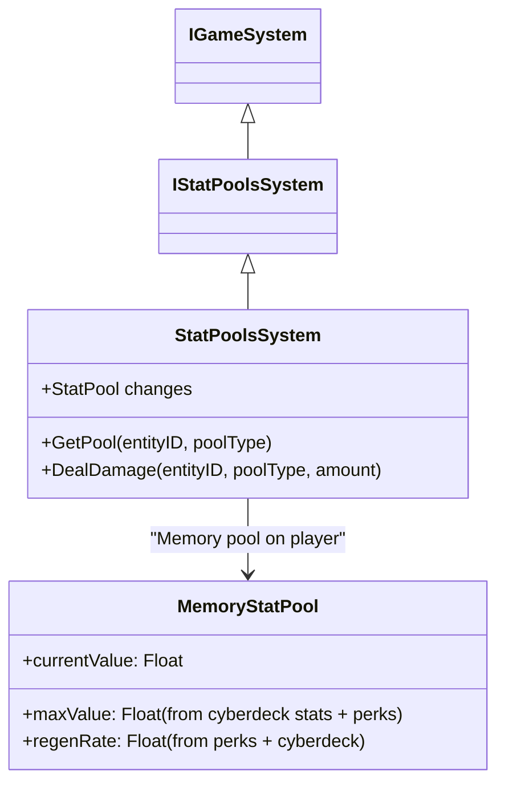

### Player Components Relevant to Hacking

| Component | Base Class | Hacking Role | CET Access |
|-----------|-----------|-------------|------------|
| `ScanningComponent` | `GameComponent` | Scanner / scan mode | Via component dump |
| `VisionModeComponent` | `GameComponent` | Vision modes (Kiroshi) | Via component dump |
| `QuickSlotsManager` | `ScriptableComponent` | Quick slot item management | Via component dump |
| `gamestateMachineComponent` | `gamePlayerControlledComponent` | Player state (scan mode state) | `FindComponentByType` |

---

## 3. Device Entity Hierarchy

Devices inherit through a chain from `GameObject` -> `DeviceBase` -> `Device` -> `InteractiveDevice` -> specific device types. The entity hierarchy determines **what actions are available** and **what PS class the device uses**.

### Core Device Entity Chain

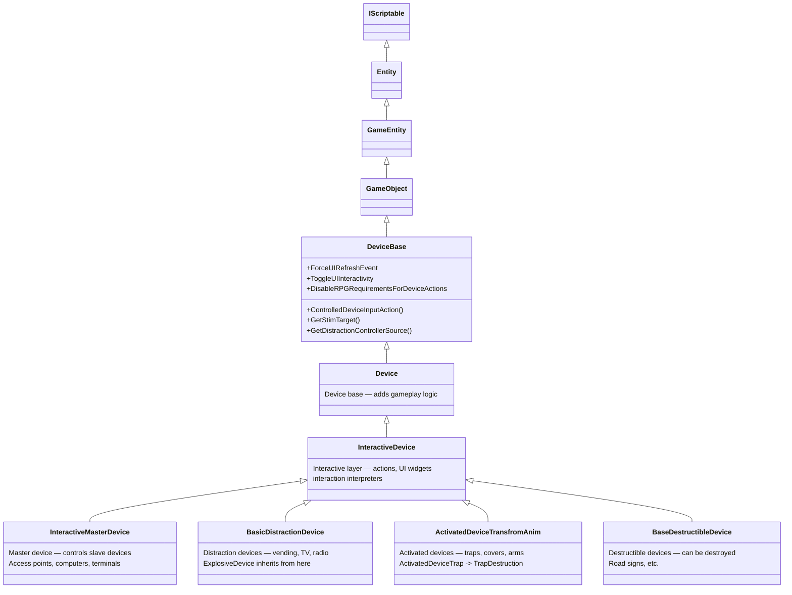

### Device Entity Hierarchy — Full Tree

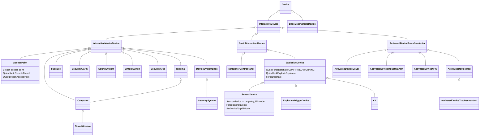

### Device Entity Details

| Class | Base Class | Fields/Methods | Role |
|-------|-----------|----------------|------|
| `DeviceBase` | `GameObject` | Events + methods | Base device with UI events, stim targets, distraction source |
| `Device` | `DeviceBase` | — | Adds gameplay logic |
| `InteractiveDevice` | `Device` | — | Interactive layer — action widgets, interaction interpreters |
| `InteractiveMasterDevice` | `InteractiveDevice` | — | Master device — controls slave devices in a network |
| `BasicDistractionDevice` | `InteractiveDevice` | — | Vending machines, TVs, radios, netrunner panels |
| `ExplosiveDevice` | `BasicDistractionDevice` | — | Fuel bottles, canisters — **QuestForceDetonate works here** |
| `BaseDestructibleDevice` | `Device` | — | Destructible objects that don't have full interactive layer |
| `ActivatedDeviceTransfromAnim` | `InteractiveDevice` | — | Transform-animated devices (traps, covers, arms) |

### What's Important for Hacking

- `DeviceBase` has `DisableRPGRequirementsForDeviceActions` event — a potential hook for bypassing RPG checks
- `InteractiveDevice` is where actions and UI widgets live — `GetQuickHackActions` and `GetQuestActions` are on the PS, not the entity
- `InteractiveMasterDevice` adds master/slave device network control
- `BasicDistractionDevice` is the parent of `ExplosiveDevice` — the only confirmed working QuestForce path
- `Device` (not Interactive) devices have fewer actions — `BaseDestructibleDevice` inherits from `Device` directly, not `InteractiveDevice`

---

## 4. Device Component & Controller Hierarchy

Each device entity has a paired **controller component** (the `ScriptableDeviceComponent`) that handles game logic, and a **persistent state** (the PS) that stores saved data and processes actions. The controller is what CET accesses via `GetDevicePS()`.

### Component Hierarchy

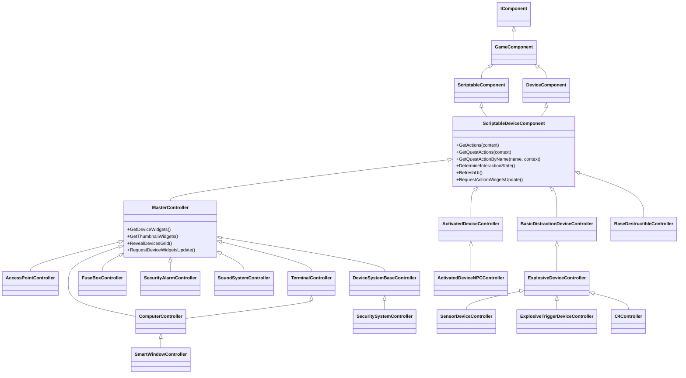

### Controller Details

| Controller | Base Class | Key Methods |
|-----------|-----------|-------------|
| `ScriptableDeviceComponent` | `DeviceComponent` | `GetActions`, `GetQuestActions`, `DetermineInteractionState`, `RefreshUI` |
| `MasterController` | `ScriptableDeviceComponent` | `GetDeviceWidgets`, `GetThumbnailWidgets`, `RevealDevicesGrid` |
| `BasicDistractionDeviceController` | `ScriptableDeviceComponent` | Device-specific action overrides |
| `ExplosiveDeviceController` | `BasicDistractionDeviceController` | `GetActions`, `GetQuestActionByName`, `GetQuestActions`, `OnActionEngineering` |
| `SensorDeviceController` | `ExplosiveDeviceController` | `ForceIgnoreTargets`, `SetDeviceTagKillMode` |
| `AccessPointController` | `MasterController` | `QuestBreachAccessPoint`, `ResetNetworkBreachState`, `ToggleNetrunnerDive` |

### How CET Accesses the Controller/PS

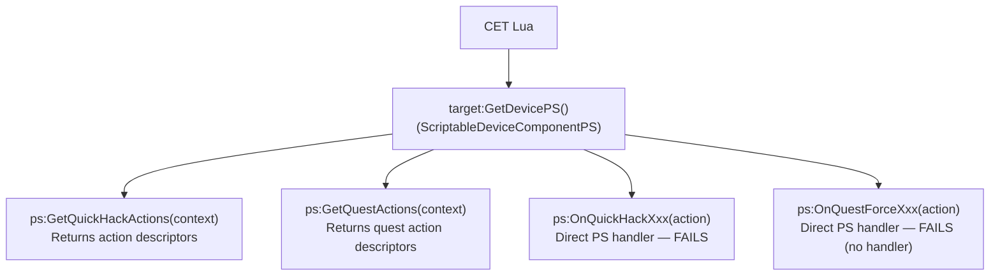

> **The controller component** (`ScriptableDeviceComponent`) is the device's game-logic handler. It lives on the device entity as a component. CET accesses its PS via `GetDevicePS()`, which returns the `ScriptableDeviceComponentPS` instance paired with the controller.

---

## 5. Device Persistent State (PS) Hierarchy

The PS (Persistent State) is where **action processing happens**. The PS holds the device's saved state, processes incoming actions via `On*` handler methods, and contains the action discovery methods (`GetQuickHackActions`, `GetQuestActions`).

### PS Class Hierarchy

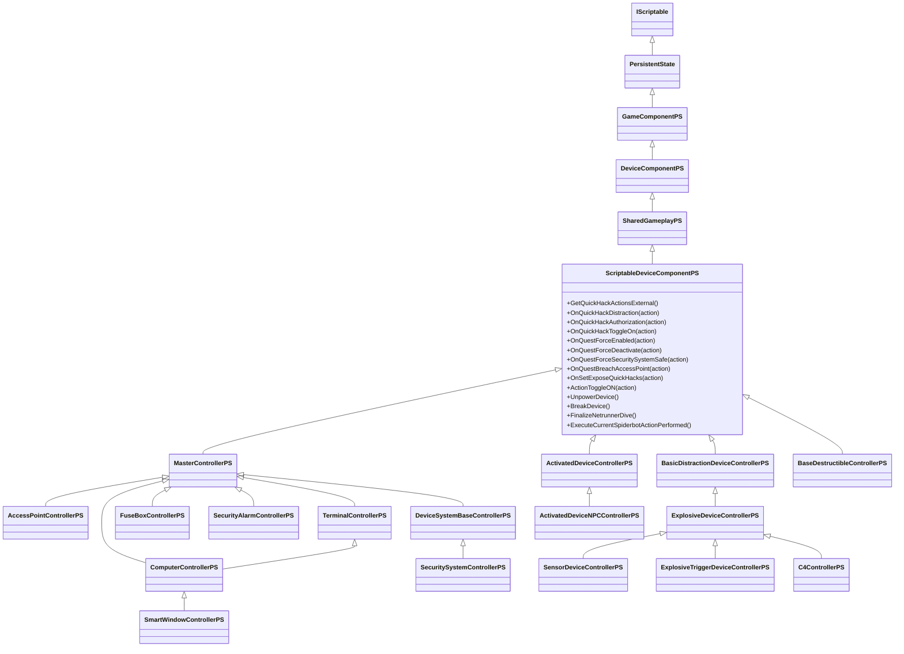

### PS Handler Methods (On* callbacks)

The PS contains `On*` methods that are the **native entry points** for action processing. These are what the normal pipeline calls after `StartAction` succeeds:

| PS Handler | Action That Triggers It | CET Direct Call Result |
|---|---|---|
| `OnQuickHackDistraction` | QuickHackDistraction | **Fails** — wrong invocation context |
| `OnQuickHackAuthorization` | QuickHackAuthorization | **Fails** |
| `OnQuickHackToggleOn` | QuickHackToggleON | **Fails** |
| `OnQuestForceEnabled` | QuestForceEnabled | **Fails** — "no PS handler" |
| `OnQuestForceDeactivate` | QuestForceDeactivate | **Fails** — "no PS handler" |
| `OnQuestForceSecuritySystemSafe` | QuestForceSecuritySystemSafe | **Fails** |
| `OnQuestBreachAccessPoint` | QuestBreachAccessPoint | **Fails** |
| `OnSetExposeQuickHacks` | SetExposeQuickHacks | **Fails** |

> **All direct PS handler calls fail from CET.** The `On*` methods expect a fully initialized action object with internal state, not the read-only descriptor returned by `GetQuickHackActions`. The "no PS handler" error suggests the method dispatch itself requires runtime context that CET cannot provide.

---

## 6. Action Class Hierarchy

Actions are the objects that carry hack commands to devices. The class hierarchy is deep and all actions ultimately inherit from `BaseScriptableAction` -> `ScriptableDeviceAction` -> `ActionBool`.

### Core Action Hierarchy

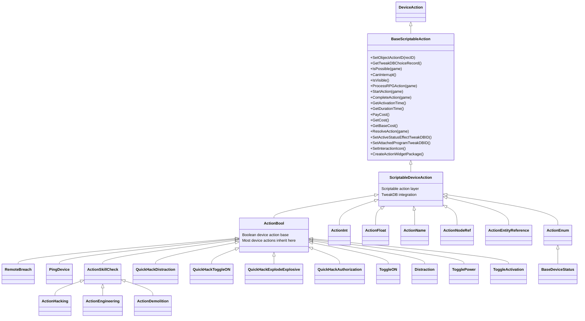

### QuestForce Action Hierarchy

```mermaid
classDiagram
    ActionBool <|-- QuestForceDetonate
    ActionBool <|-- QuestForceDestructible
    ActionBool <|-- QuestForceIndestructible
    ActionBool <|-- QuestForceInvulnerable
    ActionBool <|-- QuestForceEnabled
    ActionBool <|-- QuestForceDisabled
    ActionBool <|-- QuestForcePower
    ActionBool <|-- QuestForceUnpower
    ActionBool <|-- QuestForceON
    ActionBool <|-- QuestForceOFF
    ActionBool <|-- QuestForceActivate
    ActionBool <|-- QuestForceDeactivate
    ActionBool <|-- QuestStartGlitch
    ActionBool <|-- QuestStopGlitch
    ActionBool <|-- QuestEnableInteraction
    ActionBool <|-- QuestDisableInteraction
    ActionBool <|-- QuestForceAuthorizationEnabled
    ActionBool <|-- QuestForceSecuritySystemSafe
    ActionBool <|-- QuestForceSecuritySystemAlarmed
    ActionBool <|-- QuestForceSecuritySystemArmed
    ActionBool <|-- QuestForceCameraZoom
    ActionBool <|-- QuestForceTintGlass
    ActionBool <|-- QuestForceClearGlass
    ActionBool <|-- QuestForceRoadBlockadeActivate
    ActionBool <|-- QuestForceRoadBlockadeDeactivate
    ActionBool <|-- QuestForceJuryrigTrapArmed
    ActionBool <|-- QuestForceJuryrigTrapDeactivated
    ActionBool <|-- QuestForceDisconnectPersonalLink
    ActionBool <|-- QuestResetDeviceToInitialState
    ActionBool <|-- QuestForceFakeElevatorArrows
    ActionBool <|-- QuestResetPerfomedActionsStorage
    ActionBool <|-- QuestRemoveQuickHacks
    ActionBool <|-- QuestRestoreQuickHacks
    ActionBool <|-- QuestBreachAccessPoint
    ActionBool <|-- QuestEnableFixing
    ActionBool <|-- QuestDisableFixing

    class QuestForceDetonate {
        CONFIRMED WORKING
        Explodes ExplosiveDevice
    }
```

### QuickHack vs QuestForce vs Spiderbot Actions

The device system has three categories of actions, each designed for a different initiator:

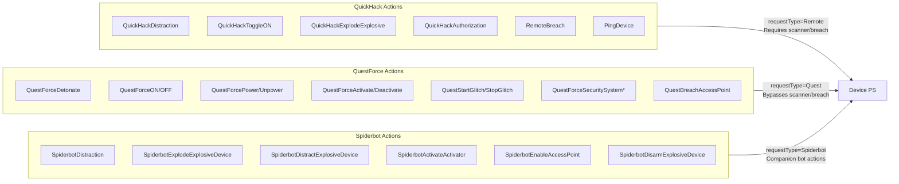

### Action Categories

| Category | Request Type | Requires Scanner | Bypasses RPG | Confirmed Working |
|---|---|---|---|---|
| QuickHack | `Remote` | Yes | No | Only `ProcessRPGAction` (API OK, no effect) |
| QuestForce | `Quest` | No | Yes (`ignoresRPG = true`) | **QuestForceDetonate only** |
| Spiderbot | `Spiderbot` | No | Yes | Not tested from CET |
| Toggle/Set | `Remote` or `Quest` | Depends | Depends | Not tested |

### Action Object Lifecycle (What CET Gets Wrong)

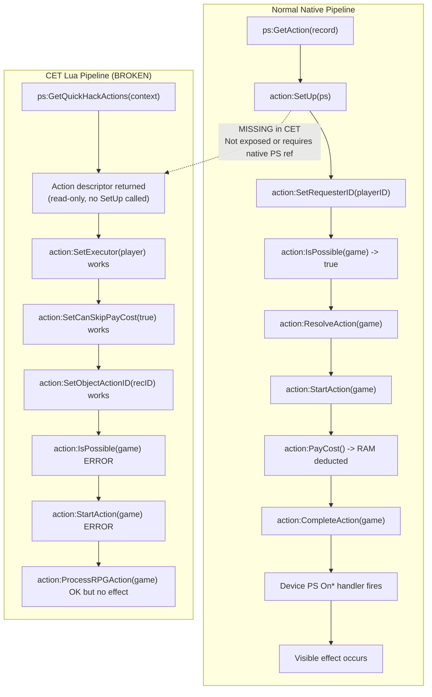

> **The critical gap**: `SetUp(ps)` initializes the action's internal state and connects it to the device PS. Without this call, the action object is a read-only descriptor. CET's Lua bindings cannot call `SetUp()` — it likely requires a native `ScriptableDeviceComponentPS` reference that CET cannot properly marshal.


---

## 7. Device Operations Hierarchy

Device operations are the device's **native effect execution system** — they run independently of the action pipeline and can trigger visual effects, damage, stims, status effects, and more. These are triggered internally by the device's PS handlers and are **untested from CET**.

### Operations Hierarchy

```mermaid
classDiagram
    IScriptable <|-- DeviceOperationBase
    DeviceOperationBase <|-- GenericDeviceOperation
    DeviceOperationBase <|-- SetMessageDeviceOperation
    DeviceOperationBase <|-- RequestCLSStateChangeDeviceOperation
    DeviceOperationBase <|-- ToggleComponentsDeviceOperation
    DeviceOperationBase <|-- PlayTransformAnimationDeviceOperation
    DeviceOperationBase <|-- FactsDeviceOperation
    DeviceOperationBase <|-- PlayEffectDeviceOperation
    DeviceOperationBase <|-- StimDeviceOperation
    DeviceOperationBase <|-- PlaySoundDeviceOperation
    DeviceOperationBase <|-- ApplyStatusEffectDeviceOperation
    DeviceOperationBase <|-- ApplyDamageDeviceOperation
    DeviceOperationBase <|-- ItemsDeviceOperation
    DeviceOperationBase <|-- TeleportDeviceOperation
    DeviceOperationBase <|-- MeshAppearanceDeviceOperation
    DeviceOperationBase <|-- PlayerWokrspotDeviceOperation
    DeviceOperationBase <|-- PlayBinkDeviceOperation
    DeviceOperationBase <|-- ToggleCustomActionDeviceOperation
    DeviceOperationBase <|-- ToggleOffMeshConnectionsDeviceOperation
    DeviceOperationBase <|-- TeleportNodetoSlotOperation

    class DeviceOperationBase {
        +Execute()
        +Restore()
    }
    class PlayEffectDeviceOperation {
        Play visual effect on device
    }
    class ApplyDamageDeviceOperation {
        Apply damage via device operation
    }
    class StimDeviceOperation {
        Trigger AI stim via device
    }
    class ApplyStatusEffectDeviceOperation {
        Apply status effect via device
    }
    class ItemsDeviceOperation {
        Spawn items via device
    }
```

### Operations Container & Triggers

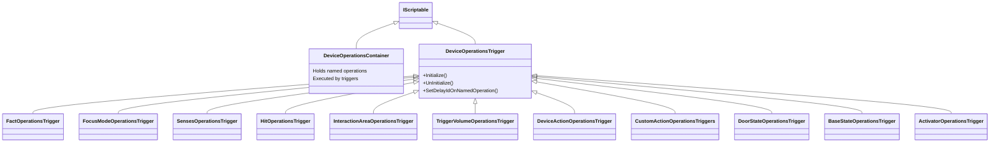

### Operations Component Classes

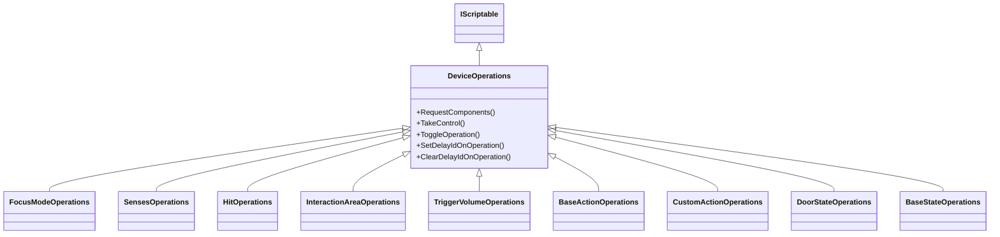

### How Operations Relate to Actions

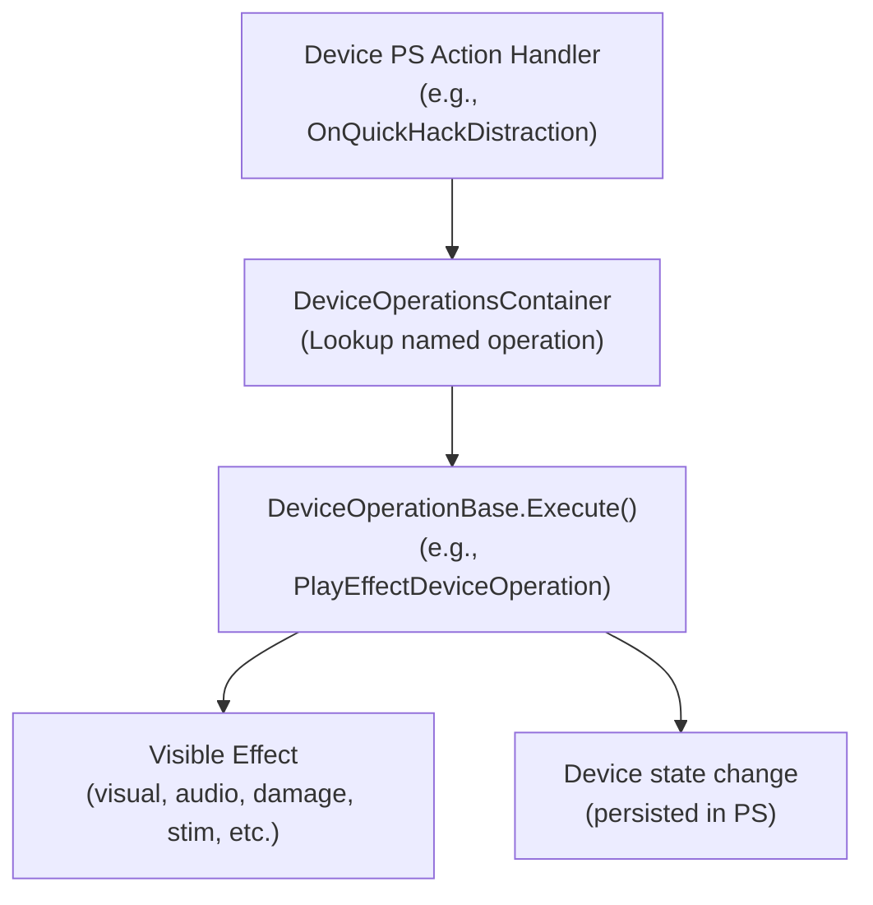

> **Device operations are the mechanism by which PS action handlers produce visible effects.** When `OnQuickHackDistraction` fires natively, it likely triggers a `PlayEffectDeviceOperation` or `StimDeviceOperation` in the device's operations container. The reason CET's `ProcessRPGAction` produces no visible effect is that the operation trigger chain is never activated — the PS handler never fires.

---

## 8. Effect Executor Hierarchy

Effect executors are native gameplay effect handlers used for **point-based and area-based effects**. They are part of the `gameEffect` system and can produce effects at arbitrary positions — ideal for companion orb point-based effects.

### Effect Executor Hierarchy

```mermaid
classDiagram
    EffectExecutor_Scripted <|-- RemotelyConnectToAccessPoint
    EffectExecutor_Scripted <|-- EffectExecutor_PuppetForceVisionAppearance
    EffectExecutor_Scripted <|-- ApplyJammer
    EffectExecutor_Scripted <|-- ApplyJammerFromCw
    EffectExecutor_Scripted <|-- EMP
    EffectExecutor_Scripted <|-- EMPExplosion
    EffectExecutor_Scripted <|-- EffectExecutor_PingNetwork
    EffectExecutor_Scripted <|-- EffectExecutor_MuteBubble
    EffectExecutor_Scripted <|-- EffectExecutor_Device
    EffectExecutor_Scripted <|-- EffectExecutor_GrenadeTargetTracker
    EffectExecutor_Scripted <|-- EffectExecutor_TrackTargets
    EffectExecutor_Scripted <|-- EffectExecutor_SendActionSignal
    EffectExecutor_Scripted <|-- EffectExecutor_VisualEffectAtTarget

    EffectExecutor_Device <|-- EffectExecutor_SetDeviceOFF
    EffectExecutor_Device <|-- EffectExecutor_SetDeviceON
    EffectExecutor_Device <|-- EffectExecutor_ToggleDevice

    class EffectExecutor_Scripted {
        Base scripted effect executor
        Part of gameEffect system
    }
    class EffectExecutor_VisualEffectAtTarget {
        Visual effect at arbitrary position
        Ideal for point-based orb effects
    }
    class EMP {
        EMP effect
    }
    class EMPExplosion {
        EMP explosion effect
    }
    class EffectExecutor_SetDeviceON {
        Turn device on via effect
    }
    class EffectExecutor_ToggleDevice {
        Toggle device state via effect
    }
```

### Effect Filters

Effect executors use filters to determine valid targets:

```mermaid
classDiagram
    EffectObjectSingleFilter_Scripted <|-- IsAccessPointFilter
    EffectObjectSingleFilter_Scripted <|-- IsDeviceTargetValidFilter
    EffectObjectSingleFilter_Scripted <|-- CanAIReactToStimTypeFilter
    EffectObjectSingleFilter_Scripted <|-- IsDeviceFilter
    EffectObjectSingleFilter_Scripted <|-- IsPlayerFilter
    EffectObjectSingleFilter_Scripted <|-- IsCoverDevice
    EffectObjectSingleFilter_Scripted <|-- EffectFilter_DamageOverTime
    EffectObjectSingleFilter_Scripted <|-- NotInDefeated
    EffectObjectSingleFilter_Scripted <|-- IgnoreFriendlyTargets
    EffectObjectSingleFilter_Scripted <|-- IgnorePlayerMountedVehicle
    EffectObjectSingleFilter_Scripted <|-- IsLootContainer

    EffectObjectGroupFilter_Scripted <|-- OnlyNearest_AINavPath_Device
    EffectObjectGroupFilter_Scripted <|-- IsSourceDeviceActveFilter
```

### Effect Executor vs Device Operations

| Aspect | Effect Executors | Device Operations |
|---|---|---|
| System | `gameEffect` system | Device operations container |
| Trigger | Part of gameEffect pipeline (status effects, quickhack effects) | Device PS handlers, triggers (focus, senses, hit, etc.) |
| Position | Can target arbitrary positions | Tied to device entity |
| CET Access | `gameEffect` construction API (untested) | Via `DeviceOperationsComponent` (untested) |
| Best for | Point-based effects at arbitrary locations (healing bubbles, sparks) | Device-internal effects (play effect, damage, stim) |

---

## 9. The Effect/Action Pipeline

This section diagrams the full pipeline from player scan to visible effect, showing every class and system involved.

### Normal Quickhack Pipeline (Player-Initiated)

```mermaid
flowchart TD
    P1["Player enters scan mode\n(ScanningComponent)"] --> P2["Targeting system selects device\n(TSF_Quickhackable filter)"]
    P2 --> P3["HUDQuickhackMenuController opens\n(Scanner UI)"]
    P3 --> P4["QuickhackSystem validates prerequisites"]
    P4 --> P5{"Cyberdeck equipped?\n(EquipmentSystem)"}
    P5 -->|No| P5F["No hacks available"]
    P5 -->|Yes| P6["Quickhack programs loaded?\n(RPGManager.GetPlayerQuickHackListWithQuality)"]
    P6 -->|No| P6F["No hacks available"]
    P6 -->|Yes| P7["Player selects hack from menu"]
    P7 --> P8["ps:GetAction(record)\nCreates FULLY INITIALIZED action"]
    P8 --> P9["action:SetUp(ps)\nConnects action to device PS"]
    P9 --> P10["action:SetRequesterID(playerID)"]
    P10 --> P11["action:IsPossible(game) -> validation"]
    P11 --> P12["Upload pipeline\n(activation time, progress bar)"]
    P12 --> P13["action:StartAction(game)"]
    P13 --> P14["action:PayCost()\nMemory stat pool -> RAM deducted"]
    P14 --> P15["action:CompleteAction(game)"]
    P15 --> P16["Device PS On* handler fires\n(e.g., OnQuickHackDistraction)"]
    P16 --> P17["DeviceOperationsContainer lookup\n-> DeviceOperation.Execute()"]
    P17 --> P18["Visible effect occurs\n(visual, audio, stim, state change)"]
    P14 --> P19["XP awarded, cooldown started"]
```

### QuestForce Pipeline (Quest-Initiated — Partially Working)

```mermaid
flowchart TD
    Q1["Quest script or CET\nrequests device state change"] --> Q2["ps:GetQuestActions(context)\nrequestType = Quest\nignoresRPG = true"]
    Q2 --> Q3["QuestForce action descriptor returned"]
    Q3 --> Q4["action:SetExecutor(player)"]
    Q4 --> Q5["action:SetObjectActionID(recID)"]
    Q5 --> Q6["Full Chain execution:\nSetupAction -> IsPossible -> ResolveAction -> StartAction"]
    Q6 --> Q7["Fallback: ProcessRPGAction(game)\nReturns API SUCCESS"]
    Q7 --> Q8{"Device type?"}
    Q8 -->|"ExplosiveDevice"| Q9["QuestForceDetonate\n-> EXPLOSION (visible)"]
    Q8 -->|"TV, Radio, etc."| Q10["No visible effect\n(API success but device ignores)"]
    Q8 -->|"SecuritySystem"| Q11["Untested\nQuestForceSecuritySystem*"]
```

### What Breaks in the CET Pipeline

```mermaid
flowchart TD
    subgraph Works["What Works in CET"]
        W1["Targeting (GetTargetingSystem)"]
        W2["Device PS access (GetDevicePS)"]
        W3["Action discovery (GetQuickHackActions)\n(GetQuestActions)"]
        W4["Action metadata (GetActionName, GetClassName, GetCost)"]
        W5["SetExecutor, SetCanSkipPayCost, SetObjectActionID"]
        W6["ProcessRPGAction (returns SUCCESS)"]
        W7["StatusEffectHelper.ApplyStatusEffect on NPCs"]
    end

    subgraph Breaks["What Breaks in CET"]
        B1["StartAction - error in error handling"]
        B2["IsPossible - error in error handling"]
        B3["ResolveAction - error in error handling"]
        B4["SetRequesterID - error in error handling"]
        B5["CanInterrupt, IsVisible - error in error handling"]
        B6["DeviceSystem:GetDeviceById - error in error handling"]
        B7["Direct PS On* handlers - fail / no handler"]
        B8["StatusEffect on devices - API OK, no effect"]
    end

    subgraph Missing["What's Missing (Root Cause)"]
        M1["action:SetUp(ps) - NOT EXPOSED TO CET"]
        M2["Full pipeline context\n(scanner, upload, cooldown, XP)"]
        M3["Device internal state machine validation\n(expects action from proper pipeline)"]
    end

    Missing --> Breaks
```

### The Three Execution Paths

```mermaid
flowchart TD
    subgraph Path1["1. QuickHack Action Path\n(requestType=Remote)"]
        direction TB
        PA1["GetQuickHackActions"] --> PA2["StartAction ERROR"]
        PA2 --> PA3["ProcessRPGAction OK (no effect)"]
        PA3 --> PA4["Result: DEAD END"]
    end

    subgraph Path2["2. QuestForce Action Path\n(requestType=Quest)"]
        direction TB
        PB1["GetQuestActions"] --> PB2["Full Chain (Setup->Start->Process)"]
        PB2 --> PB3["QuestForceDetonate works"]
        PB3 --> PB4["All others: API OK, no effect"]
        PB4 --> PB5["Result: PARTIAL (1 confirmed working)"]
    end

    subgraph Path3["3. Direct Status Effect Path\n(StatusEffectHelper)"]
        direction TB
        PC1["ApplyStatusEffect(device, effectID)"] --> PC2["API SUCCESS"]
        PC2 --> PC3["No visible effect"]
        PC3 --> PC4["Result: DEAD END for devices"]
    end

    subgraph Path4["4. DeviceOperations Path (UNTESTED)"]
        direction TB
        PD1["Access DeviceOperationsComponent"] --> PD2["Find named operation"]
        PD2 --> PD3["Operation.Execute()"]
        PD3 --> PD4["Result: UNKNOWN"]
    end

    subgraph Path5["5. EffectExecutor Path (UNTESTED)"]
        direction TB
        PE1["Construct gameEffect"] --> PE2["Set EffectExecutor type"]
        PE2 --> PE3["Execute at target position"]
        PE3 --> PE4["Result: UNKNOWN"]
    end
```

---

## 10. Game Systems Involved in Hacking

Multiple game-wide systems participate in the hacking pipeline. These are singleton systems accessible via `Game.Get*System()`.

### Systems Hierarchy

```mermaid
classDiagram
    IGameSystem <|-- gameIPlayerSystem
    IGameSystem <|-- IInventoryManager
    IGameSystem <|-- ISenseManager
    IGameSystem <|-- IStatPoolsSystem
    IGameSystem <|-- IStatusEffectSystem
    IGameSystem <|-- IDeviceSystem
    IGameSystem <|-- IQuickhackSystem
    IGameSystem <|-- ITargetingSystem
    IGameSystem <|-- IRPGManager
    IGameSystem <|-- IEquipmentSystem
    IGameSystem <|-- IDamageSystem

    gameIPlayerSystem <|-- gamePlayerSystem
    gamePlayerSystem <|-- PlayerSystem

    IStatPoolsSystem <|-- StatPoolsSystem
    IStatusEffectSystem <|-- StatusEffectSystem
    IDeviceSystem <|-- DeviceSystem
    ITargetingSystem <|-- TargetingSystem
    IEquipmentSystem <|-- EquipmentSystem

    class PlayerSystem {
        +GetPlayer()
    }
    class StatPoolsSystem {
        +GetPool(entityID, poolType)
        +DealDamage(entityID, poolType, amount)
        RAM / Memory pool
    }
    class StatusEffectSystem {
        +ApplyStatusEffect(entityID, recordID, instigator)
        +ObjectHasStatusEffect(entityID, recordID)
    }
    class DeviceSystem {
        +GetDeviceById(game, entityID) CET FAILS
    }
    class TargetingSystem {
        +GetObjectClosestToCrosshair(player, searchQuery)
        TSF_Quickhackable filter
    }
    class EquipmentSystem {
        +GetData(owner)
        +IsCyberdeckEquipped(owner)
    }
```

### System Roles in Hacking

| System | CET Accessor | Role in Hacking | CET Status |
|---|---|---|---|
| `PlayerSystem` | `Game.GetPlayerSystem()` | Get player entity | Works |
| `TargetingSystem` | `Game.GetTargetingSystem()` | Select hackable target | Works |
| `EquipmentSystem` | `Game.GetEquipmentSystem()` | Check cyberdeck equipped | Works |
| `StatPoolsSystem` | `Game.GetStatPoolsSystem()` | RAM / Memory pool | Works |
| `StatusEffectSystem` | `Game.GetStatusEffectSystem()` | Apply status effects | API works, no device effect |
| `DeviceSystem` | `Game.GetDeviceSystem()` | Get device by ID | Error in error handling |
| `QuickhackSystem` | `Game.GetQuickhackSystem()` | Quickhack management | Untested |
| `RPGManager` | Static | Build quickhack list | Unexposed? |

---

## 11. Key Takeaways

### What Objects Are Needed for Device Hacking

| Object | Class | Purpose | CET Can Create? |
|---|---|---|---|
| Initiator entity | `PlayerPuppet` or proxy | `SetExecutor()`, `SetRequesterID()` | Player only; proxy needs creation |
| Cyberdeck item | TweakDB item record | `ObjectActions` array defines available hacks | TweakDB records can be created |
| Equipment data | `EquipmentSystemData` | `IsCyberdeckEquipped()` validation | Tied to real player |
| RAM pool | `StatPoolsSystem` Memory pool | `PayCost()` deduction | Tied to real player |
| Device entity | `InteractiveDevice` subclass | Target of hack | Exists in world |
| Device PS | `ScriptableDeviceComponentPS` subclass | Action processing, `On*` handlers | Accessible via `GetDevicePS()` |
| Action object | `ActionBool` subclass | Hack command carrier | Returned by discovery, **but read-only** |
| Action record | TweakDB `ObjectAction` record | Action metadata, cost, UI | TweakDB records can be created |
| Device operations | `DeviceOperationsContainer` | Native effect execution | Accessible? Untested |
| Effect executor | `EffectExecutor_Scripted` subclass | Point-based effects | `gameEffect` construction untested |

### The Core Problem in One Diagram

```mermaid
flowchart TD
    subgraph TheProblem["The Root Cause"]
        R1["GetQuickHackActions returns\nREAD-ONLY DESCRIPTORS"]
        R2["SetUp(ps) NOT EXPOSED TO CET\nCannot initialize action state"]
        R3["Device PS On* handlers expect\nFULLY INITIALIZED actions"]
        R4["Result: Action rejected by\ndevice internal state machine"]

        R1 --> R2 --> R3 --> R4
    end

    subgraph PossibleSolutions["Possible Solutions"]
        S1["A. REDscript bridge\nExposes SetUp() to CET"]
        S2["B. Shell entity with cyberware\nEmulates player pipeline context"]
        S3["C. DeviceOperations direct access\nBypass action pipeline entirely"]
        S4["D. EffectExecutor construction\nPoint-based effects at arbitrary positions"]
    end

    TheProblem --> PossibleSolutions
```

### What CET Can Do vs What Needs Native Code

| Capability | CET (Lua) | REDscript | C++ (RED4ext) |
|---|---|---|---|
| Discover device actions | Yes | Yes | Yes |
| Read action metadata | Yes | Yes | Yes |
| Set executor / skip cost | Yes | Yes | Yes |
| `SetUp(ps)` on action | No - Not exposed | Yes | Yes |
| `StartAction` with initialized action | No - Error | Yes | Yes |
| Create custom entity | No | Limited | Yes |
| Access `DeviceOperationsContainer` | Untested | Yes | Yes |
| Construct `gameEffect` with executor | Untested | Yes | Yes |
| Hook device PS handlers | No | Yes (Observe/Override) | Yes |

---

*Document generated from analysis of 11 testers, okf device core/masters/explosive/activated/destructible/components/interpreters docs, player class hierarchy physics doc, quickhack prerequisites analysis, and combat quickhack patterns. Last updated: 2026-08-03.*
