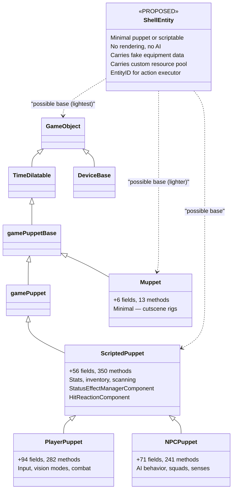
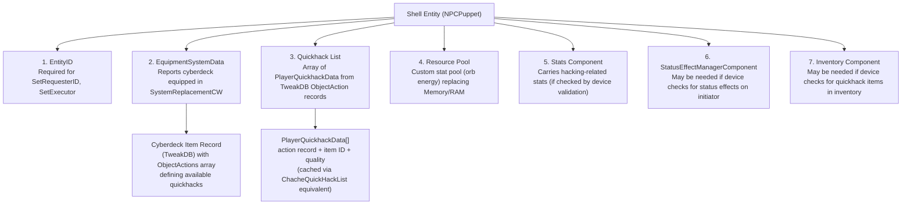
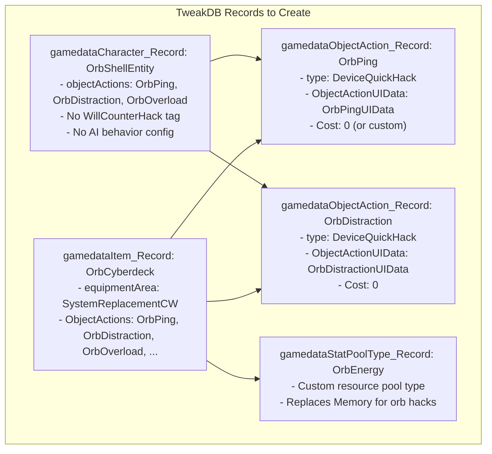
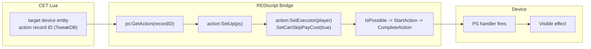
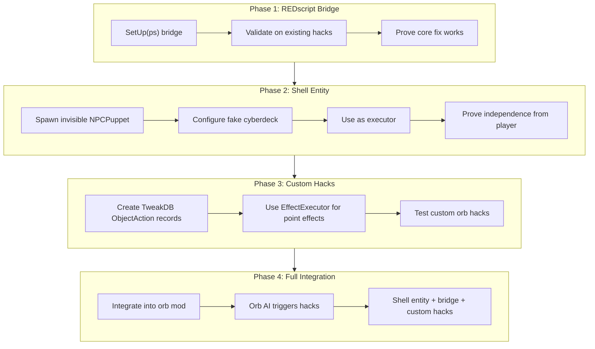
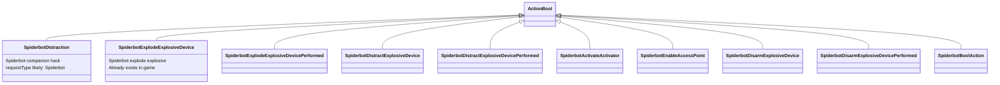
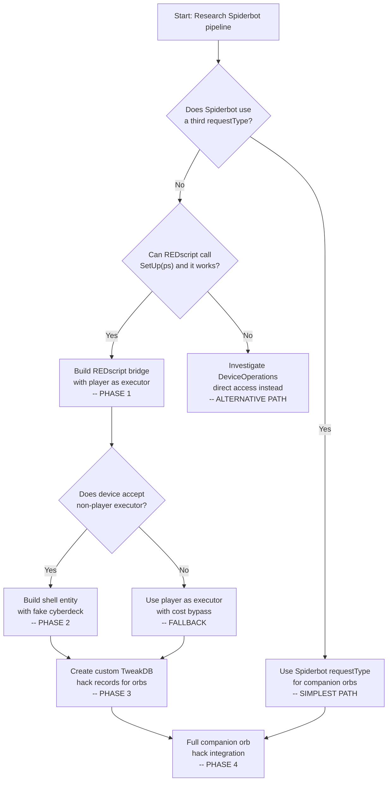

# Proposal: Shell Entity for Device Hacking

> **Scope**: Design proposal for a programmatically-created entity that emulates having a player's cyberware, enabling it to serve as the initiator/executor for device hacking actions outside the normal player pipeline. Targeted at companion drones/orbs that can quickhack.

---

## Table of Contents

1. [Problem Statement](#1-problem-statement)
2. [Concept: The Shell Entity](#2-concept-the-shell-entity)
3. [Architecture](#3-architecture)
4. [Required Objects](#4-required-objects)
5. [Implementation Approaches](#5-implementation-approaches)
6. [Integration with the Device Action Pipeline](#6-integration-with-the-device-action-pipeline)
7. [Alternative: REDscript Bridge](#7-alternative-redscript-bridge)
8. [Hybrid Approach](#8-hybrid-approach)
9. [Risks & Unknowns](#9-risks--unknowns)
10. [Recommended Path](#10-recommended-path)

---

## 1. Problem Statement

### What We Want

Companion drones (follower orbs) that can perform quickhack-like effects on devices and NPCs — **independent of the player and the player's cyberware**.

### What We've Tried (and why it fails)

Extensive testing (documented in `testers/quickhack/device hack summary.md`) shows that triggering device hacks programmatically from CET Lua fails because:

1. **Action objects are read-only descriptors** — `GetQuickHackActions()` returns metadata-only objects, not fully initialized executable instances
2. **`SetUp(ps)` is not exposed to CET** — the critical initialization step that connects an action to its device PS cannot be called from Lua
3. **The device's internal state machine rejects out-of-context actions** — even when `ProcessRPGAction` returns SUCCESS, the device's PS handler never fires, so no visible effect occurs
4. **Status effects don't work on devices** — `BaseStatusEffect.*` records are designed for puppets (NPCs/player), not device entities
5. **Direct PS handler calls fail** — calling `ps:OnQuickHackDistraction(action)` directly fails because the action object lacks internal state and the invocation context is wrong

### What Works

- **QuestForceDetonate on ExplosiveDevice** — confirmed working via the QuestForce path (`requestType=Quest`, `ignoresRPG=true`)
- **NPC status effects** — behavioral effects (Stun, Blind, Madness, Ping, LocomotionMalfunction) work via `StatusEffectHelper.ApplyStatusEffect`
- **Blackwall instant kill** — quest status effect with `DealDamageModule` works on NPCs

### The Core Insight

The game's quickhack system requires a **full pipeline context** — an initiator entity with cyberware, an action object with internal state, and a device PS that recognizes the action as valid. Bypassing the player-level checks (cyberdeck, RAM, scan mode) is easy; bypassing the device-level validation is the unsolved problem.

**The question: Can we create an entity that looks enough like a player to the device's validation system that it accepts and processes hacking actions?**

---

## 2. Concept: The Shell Entity

### The Idea

Create a lightweight, invisible entity that carries the minimum set of objects needed to satisfy the device's internal validation when a hacking action is executed against it. This entity acts as a **cyberware proxy** — it emulates having a cyberdeck, quickhack programs, and RAM, so the device's state machine accepts the action as coming from a legitimate source.

```mermaid
flowchart TD
    subgraph Normal["Normal Pipeline"]
        N1["PlayerPuppet"] --> N2["EquipmentSystem\n(cyberdeck in SystemReplacementCW)"]
        N2 --> N3["RPGManager builds quickhack list"]
        N3 --> N4["Memory stat pool (RAM)"]
        N4 --> N5["Action instantiated + SetUp(ps)"]
        N5 --> N6["Device accepts action"]
    end

    subgraph Shell["Shell Entity Pipeline (Proposed)"]
        S1["ShellEntity\n(invisible, no rendering)"] --> S2["Fake EquipmentData\n(cyberdeck present)"]
        S2 --> S3["Custom quickhack list\n(from TweakDB records)"]
        S3 --> S4["Custom resource pool\n(orb's energy, not player RAM)"]
        S4 --> S5["Action instantiated + SetUp(ps)\n(via REDscript bridge)"]
        S5 --> S6["Device accepts action"]
    end
```



### What the Shell Entity Is NOT

- **Not a full PlayerPuppet** — no rendering, no input, no locomotion, no camera
- **Not an NPCPuppet** — no AI behavior tree, no squad, no sense system
- **Not a device** — it doesn't have device actions or a device PS
- **Not a Muppet** — cutscene rig puppets are too limited

### What the Shell Entity IS

A minimal `ScriptedPuppet` (or similar scriptable entity) that:
- Has an `EntityID` (required for `SetRequesterID`, `SetExecutor`)
- Carries equipment data that reports a cyberdeck is equipped
- Has a stat pool for its own resource (energy/charge, not player RAM)
- Can be set as the executor/requester on action objects
- Exists in the world (even if invisible) so the engine considers it a valid entity

---

## 3. Architecture

### Entity Class Options



### Option A: Spawn a Real NPCPuppet (Disguised)

Spawn an invisible NPCPuppet, configure it with the right equipment and stats, and use it as the executor for device actions.

**Pros:**
- Full entity with EntityID, components, stats
- EquipmentSystem can manage items on it
- StatPoolsSystem can create pools for it
- Already supported by the engine

**Cons:**
- Heavy — 71 fields, 241 methods, full AI system
- May trigger AI behavior (combat, senses) unless disabled
- May be targeted by enemies
- Requires appearance/mesh management to stay invisible

### Option B: Spawn a Muppet (Minimal Puppet)

Spawn a Muppet — the lightest puppet class with only 6 fields and 13 methods.

**Pros:**
- Very lightweight
- Has EntityID
- No AI system

**Cons:**
- May lack the components needed for equipment/stat validation
- Not designed for gameplay interaction
- Unknown if `EquipmentSystem` works with Muppets

### Option C: Custom Scriptable Entity (REDscript/C++)

Define a custom entity class in REDscript or C++ that has exactly the components needed.

**Pros:**
- Minimal — only what's needed
- Full control over component setup
- No AI, no rendering, no unwanted systems

**Cons:**
- Requires REDscript or C++ (not pure CET Lua)
- Entity class definition is complex
- Need to register the entity type with the engine

### Recommended: Option C (Custom Scriptable Entity)

This will take some effort, but once working, it will be a functional piece of a final custom OrbPuppet

---

## 4. Required Objects

### Objects the Shell Entity Must Carry



### Detailed Object Breakdown

| # | Object | Class/Type | Purpose | How to Create |
|---|---|---|---|---|
| 1 | EntityID | `EntityID` | Action executor/requester identification | Auto-assigned on entity spawn |
| 2 | Equipment data | `EquipmentSystemData` | `IsCyberdeckEquipped()` returns true | Equip a cyberdeck item via `EquipmentSystem` or fake the data |
| 3 | Cyberdeck item | TweakDB `gamedataItem_Record` | `ObjectActions` array defines quickhack programs | Create TweakDB item record with `ObjectActions` pointing to desired quickhack action records |
| 4 | Quickhack programs | `PlayerQuickhackData[]` | Available hacks list (from cyberdeck's ObjectActions) | Build from TweakDB records, cache on entity |
| 5 | Resource pool | `StatPoolsSystem` custom pool | Replacement for Memory/RAM | Create custom stat pool type in TweakDB, register on entity |
| 6 | Hacking stats | `StatModifier` system | Hacking-related stat values if checked | Set via `StatsSystem` or TweakDB character record |
| 7 | Status manager | `StatusEffectManagerComponent` | May be checked by device validation | Inherits from `ScriptedPuppet` (NPCPuppet has this) |
| 8 | Inventory | `Inventory` component | May be checked for quickhack items | Inherits from `ScriptedPuppet` (NPCPuppet has this) |

### TweakDB Records Needed



---

## 5. Implementation Approaches

> NOTE: in section 3, the model recommended `Option A: Spawn a Real NPCPuppet (Disguised)`, but I disagree and changed the recommendation to Option C.  This next section was likely written based on that Option A and is too limited for Option C.  Leaving the below text here, but know that it won't work as is with Option C

### Approach 1: Pure CET Lua + TweakDB (Ambitious)

Create the shell entity and all TweakDB records from CET Lua, then use it as the executor for device actions.

**Steps:**

```lua
-- 1. Create TweakDB records for orb cyberdeck and quickhacks
local cyberdeckRecord = TweakDB:CreateRecord("Items.OrbCyberdeck", "gamedataItem_Record")
-- ... configure ObjectActions array with desired quickhack records ...

-- 2. Spawn an invisible NPCPuppet
local entitySpec = GameEntitySpawner.SpawnEntitySpec(...)
local shellEntity = GameEntitySpawner.SpawnEntity(...)

-- 3. Equip the cyberdeck on the shell entity
EquipmentSystem:GetData(shellEntity):EquipItem(cyberdeckRecord)

-- 4. Use shell entity as executor for device actions
local ps = target:GetDevicePS()
local context = NewObject("gameGetActionsContext")
context.requestorID = shellEntity:GetEntityID()
context.requestType = gamedataRequestType.Remote
context.processInitiatorObject = shellEntity
context.ignoresRPG = true

local actions = ps:GetQuickHackActions(context)
-- ... execute with shellEntity as executor ...
```

**Likelihood of success:** Low — even with a proper entity as executor, the fundamental problem (action objects lack `SetUp()` initialization) remains. The device's internal state machine may still reject the action.

### Approach 2: REDscript Bridge + CET Controller (Recommended)

Use a small REDscript mod that exposes the missing `SetUp()` call and action execution to CET Lua. The shell entity is spawned and configured from CET, but the REDscript bridge handles the action instantiation and execution.

**REDscript side:**

```redscript
// Bridge module: OrbHackingBridge.reds
public class OrbHackingBridge extends ScriptableSystem {
    public func ExecuteDeviceAction(
        device: ref<ScriptableDeviceComponent>,
        actionRecordID: TweakDBID,
        executor: ref<Entity>
    ) -> Bool {
        let ps = device.GetPS() as ScriptableDeviceComponentPS;
        if !IsDefined(ps) { return false; }

        // Get properly initialized action via native pipeline
        let action = ps.GetAction(actionRecordID);
        if !IsDefined(action) { return false; }

        // THE MISSING STEP — connect action to device PS
        action.SetUp(ps);
        action.SetExecutor(executor);
        action.SetRequesterID(executor.GetEntityID());
        action.SetCanSkipPayCost(true);

        // Execute through native pipeline
        if !action.IsPossible(GetGameInstance()) { return false; }
        action.ResolveAction(GetGameInstance());
        action.StartAction(GetGameInstance());
        action.CompleteAction(GetGameInstance());

        return true;
    }
}
```

**CET side:**

```lua
-- 1. Spawn shell entity (invisible NPCPuppet with fake cyberdeck)
local shellEntity = SpawnShellEntity()

-- 2. Call REDscript bridge to execute device action
local bridge = Game.GetScriptableSystem("OrbHackingBridge")
bridge:ExecuteDeviceAction(target:GetDeviceComponent(), "QuickHackDistraction", shellEntity)
```

**Likelihood of success:** High — this directly addresses the root cause (`SetUp()` not exposed to CET) and lets the native pipeline handle action execution with a proper executor entity.

### Approach 3: Full REDscript Entity (Most Complete)

Define the shell entity entirely in REDscript, including custom components, fake equipment data, and action execution logic. CET Lua only triggers high-level commands.

```redscript
public class OrbShellEntity extends ScriptedPuppet {
    // Custom fields
    let m_orbEnergy: Float;
    let m_maxOrbEnergy: Float;
    let m_availableHacks: array<ref<PlayerQuickhackData>>;

    // Override equipment check to always return true for cyberdeck
    public func IsCyberdeckEquipped() -> Bool { return true; }

    // Override RAM check to use orb energy
    public func GetMemoryPool() -> Float { return m_orbEnergy; }

    // Execute a device hack
    public func HackDevice(device: ref<ScriptableDeviceComponent>, actionRecordID: TweakDBID) -> Bool {
        let ps = device.GetPS() as ScriptableDeviceComponentPS;
        let action = ps.GetAction(actionRecordID);
        action.SetUp(ps);
        action.SetExecutor(this);
        action.SetCanSkipPayCost(true);
        action.StartAction(GetGameInstance());
        action.CompleteAction(GetGameInstance());
        return true;
    }
}
```

**Likelihood of success:** Highest — full control over the entity and execution pipeline. But requires the most REDscript work.


---

## 6. Integration with the Device Action Pipeline

### How the Shell Entity Fits Into the Pipeline

```mermaid
flowchart TD
    subgraph OrbControl["Companion Orb (CET Lua)"]
        OC1["Orb AI logic decides\nto hack a device"]
        OC2["Selects target device\n(via targeting or position)"]
        OC3["Selects which hack to use\n(from orb's hack list)"]
    end

    subgraph ShellEntity["Shell Entity"]
        SE1["Invisible NPCPuppet\nwith fake cyberdeck"]
        SE2["EquipmentSystem reports\ncyberdeck equipped"]
        SE3["Quickhack list loaded\nfrom TweakDB records"]
        SE4["Custom resource pool\n(orb energy, not player RAM)"]
    end

    subgraph RedscriptBridge["REDscript Bridge"]
        RB1["ps:GetAction(recordID)\nCreates initialized action"]
        RB2["action:SetUp(ps)\nConnects to device PS"]
        RB3["action:SetExecutor(shellEntity)\nShell entity is the hacker"]
        RB4["action:SetCanSkipPayCost(true)\nNo RAM cost"]
        RB5["action:IsPossible -> StartAction -> CompleteAction\nFull native pipeline execution"]
    end

    subgraph Device["Target Device"]
        D1["Device PS receives action\nvia native pipeline"]
        D2["Device internal validation:\n- Executor has cyberdeck? (shell entity)\n- Action is initialized? (SetUp called)\n- Pipeline context valid? (native execution)"]
        D3["PS On* handler fires\n(e.g., OnQuickHackDistraction)"]
        D4["DeviceOperationsContainer\n-> Operation.Execute()"]
        D5["VISIBLE EFFECT"]
    end

    OC1 --> OC2 --> OC3
    OC3 --> SE1
    SE1 --> SE2 --> SE3 --> SE4
    SE4 --> RB1
    RB1 --> RB2 --> RB3 --> RB4 --> RB5
    RB5 --> D1 --> D2 --> D3 --> D4 --> D5
```



### What Changes vs the Broken CET Pipeline

| Pipeline Stage | CET Alone (BROKEN) | Shell Entity + REDscript (PROPOSED) |
|---|---|---|
| Executor | PlayerPuppet (real player) | Shell entity (fake cyberdeck) |
| Action discovery | `GetQuickHackActions` -> read-only descriptors | `GetAction(recordID)` -> initialized action |
| `SetUp(ps)` | Not exposed to CET | REDscript can call it |
| `IsPossible` | Error | Action has internal state |
| `StartAction` | Error | Action is fully initialized |
| Device validation | Silently rejects | Executor has cyberdeck, action is initialized |
| PS handler fires | Never | Native pipeline triggers it |
| Visible effect | None | DeviceOperations execute |

---

## 7. Alternative: REDscript Bridge (Minimal)

If creating a full shell entity proves too complex, a **minimal REDscript bridge** alone may solve the core problem. The bridge would:

1. Accept a device entity and action record ID from CET
2. Call `ps:GetAction(recordID)` to get a properly initialized action
3. Call `action:SetUp(ps)` — the missing step
4. Use the real player as executor (but with `SetCanSkipPayCost(true)`)
5. Execute through the native pipeline



**This approach doesn't need a shell entity at all** — it just fixes the missing `SetUp()` call. However, it uses the real player as executor, which means:
- Player must have a cyberdeck equipped (or validation fails)
- Player is the instigator (XP, cooldown, threat detection may apply)
- Hacks are tied to the player's installed programs

### Comparison: Shell Entity vs Minimal Bridge

| Aspect | Shell Entity + Bridge | Minimal Bridge Only |
|---|---|---|
| Cyberdeck required | No (emulated) | Yes (player must have one) |
| RAM cost | No (custom pool) | Bypassed (SetCanSkipPayCost) |
| XP/threat | No (shell entity, not player) | Yes (player is executor) |
| Hack list | Custom (TweakDB records) | Limited to player's installed programs |
| Complexity | High (entity + TweakDB + bridge) | Low (just the bridge) |
| Independence from player | Full | None |
| Best for | Companion orbs | Quick prototyping, testing |

---

## 8. Hybrid Approach

### Phase 1: Minimal REDscript Bridge (Validate the Core Fix)

Start with just the REDscript bridge that calls `SetUp(ps)` and executes actions natively. Use the real player as executor with `SetCanSkipPayCost(true)`.

**Goal:** Prove that `SetUp(ps)` is the missing piece and that native pipeline execution produces visible effects.

**Success criteria:**
- `QuickHackDistraction` on a TV produces visible distraction effect
- `QuickHackExplodeExplosive` on a fuel canister produces explosion
- `QuestForceDetonate` continues working (regression check)

### Phase 2: Shell Entity (Decouple from Player)

Once the bridge is proven, spawn an invisible NPCPuppet and configure it as the executor.

**Goal:** Prove that a non-player entity with fake equipment can serve as executor.

**Success criteria:**
- Device accepts action with shell entity as executor (not player)
- No XP awarded, no cooldown on player, no threat detection
- Hacks work even when player has no cyberdeck equipped

### Phase 3: Custom TweakDB Records (Orb-Specific Hacks)

Create custom `ObjectAction` records for orb-specific hacks (healing bubbles, time distortion, spark explosions) using the `EffectExecutor` system for point-based effects.

**Goal:** Custom effects at arbitrary positions, not just pre-existing device hacks.

**Success criteria:**
- Healing bubble effect plays at target position
- Spark explosion effect plays at target position
- Time distortion bubble effect plays at target position

### Phase 4: Full Companion Orb Integration

Integrate the shell entity and bridge into the companion orb mod. Orbs trigger hacks via CET Lua, the shell entity serves as the cyberware proxy, and the REDscript bridge handles native execution.



---

## 9. Risks & Unknowns

### Technical Risks

| Risk | Likelihood | Impact | Mitigation |
|---|---|---|---|
| `SetUp(ps)` not sufficient to fix action execution | Medium | Critical | Phase 1 tests this first |
| Device validation checks for `PlayerPuppet` specifically (not any `ScriptedPuppet`) | Medium | Critical | Test with NPCPuppet first; may need to override `IsA(PlayerPuppet)` check |
| `EquipmentSystem` doesn't work on spawned NPCPuppets | Low | High | May need to fake equipment data differently |
| Stat pool validation requires specific pool type (Memory) | Medium | Medium | Use `SetCanSkipPayCost(true)` to bypass |
| Action execution still requires scanner mode context | Low | High | QuestForce path bypasses this; test both paths |
| `ps:GetAction(recordID)` may not exist or work differently than expected | Medium | Critical | Research okf API docs for `GetAction` method signature |
| REDscript `SetUp()` call signature may differ from what CET observes | Low | Medium | Check okf for exact method signature |

### Design Risks

| Risk | Likelihood | Impact | Mitigation |
|---|---|---|---|
| Shell entity triggers unwanted AI behaviors | Medium | Medium | Disable AI components, set inactive |
| Shell entity is targeted by enemies | Medium | Medium | Make invisible, position in safe location |
| Custom TweakDB records break save games | Low | High | Use `TweakXL` for safe record creation |
| EffectExecutor system can't produce arbitrary effects from CET | Medium | High | May need REDscript for effect construction too |

### Unknowns to Research

| Unknown | Where to Find Answer |
|---|---|
| Does `ps:GetAction(recordID)` exist as a method? | okf `devices/core.md` — check `ScriptableDeviceComponentPS` methods |
| What is the exact `SetUp()` method signature? | okf — search for `SetUp` in device action classes |
| Does device validation check `IsA(PlayerPuppet)` or just `IsA(ScriptedPuppet)`? | okf — search device PS handlers for executor type checks |
| Can `EquipmentSystem:GetData()` work on non-player entities? | okf — check `EquipmentSystem` API |
| Does `QuickhackSystem` have methods usable from CET? | okf — `Game.GetQuickhackSystem()` API docs |
| Can `gameEffect` be constructed and executed from REDscript? | okf — `EffectExecutor_Scripted` usage patterns |
| Are there existing companion bot (Spiderbot) action patterns? | okf — `SpiderbotDistraction`, `SpiderbotExplodeExplosiveDevice` classes |

### The Spiderbot Precedent

The device system already has **Spiderbot action classes** — `SpiderbotDistraction`, `SpiderbotExplodeExplosiveDevice`, `SpiderbotDistractExplosiveDevice`, `SpiderbotActivateActivator`, `SpiderbotEnableAccessPoint`, `SpiderbotDisarmExplosiveDevice`. These suggest the game already has a companion bot hacking pipeline.



> **The Spiderbot actions are a strong signal** that the engine supports companion-entity-initiated device hacks. The Spiderbot (the player's companion drone in the game) has its own action classes, separate from QuickHack (player) and QuestForce (quest scripts). This means there's a third request type — `Spiderbot` — designed specifically for companion bots. **Researching how the game's Spiderbot hacking works should be a high priority.**

---

## 10. Recommended Path

### Immediate Next Steps

1. **Research Spiderbot action pipeline** — How does the game's Spiderbot execute device hacks? What `requestType` does it use? How are Spiderbot actions instantiated and executed? This is the closest existing analog to what we're trying to build.

2. **Research `ps:GetAction(recordID)`** — Confirm this method exists and returns a properly initialized action (unlike `GetQuickHackActions` which returns descriptors). Check okf API docs for the exact method signature.

3. **Research `SetUp()` method** — Find the exact method signature and determine if it's callable from REDscript. This is the critical missing piece.

4. **Build the minimal REDscript bridge** — Even before the shell entity, prove that `SetUp(ps)` + native pipeline execution produces visible effects when called from REDscript with the player as executor.

5. **Test with QuestForce path first** — Since QuestForce already partially works, add `SetUp()` to the QuestForce chain and see if more QuestForce actions produce visible effects (not just QuestForceDetonate).

### Decision Tree



### Why the Spiderbot Path Could Be the Answer

If the game's Spiderbot already has a working companion-bot hacking pipeline, we may not need to build a shell entity at all. Instead, we could:

1. Use `requestType = Spiderbot` (or the equivalent enum value) in the action context
2. Use the Spiderbot action classes that already exist (`SpiderbotDistraction`, `SpiderbotExplodeExplosiveDevice`, etc.)
3. Set the orb entity (or the player's Spiderbot if one exists) as the executor

This would be the simplest path because the game engine already supports it — we'd be using an existing pipeline rather than creating a new one.

---

*Document generated from analysis of device hack testing, okf class hierarchy research, and player class hierarchy documentation. Last updated: 2026-08-03.*
